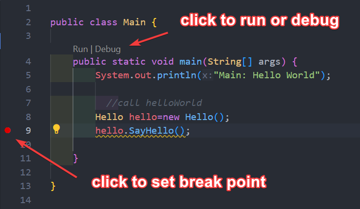

# Lesson 0. Getting Started with Java: Hello World

## 1. Introduce yourself and tell us why you want to learn programming?

Please answer it on [gist Java_01-1](https://gist.github.com/stoneskin/04206703227b3c36a855bfc1f3d3f7ca){:target="_blank"}
if you have no github account, please create one right now.

## 2. Why Java?

- What's programming languages?
- What's different between Java and other languages?

Please do google research, look into at least 3 results. 
And answer the question base your understanding at [gist Java_01-2](https://gist.github.com/stoneskin/635bfbe293450f3901b2852d9887bd9b){:target="_blank"}

## 3. What you will learn from this class

- Java foundation
- Object Oriented Programming
- Data Structure and Algorithm
- Java Projects
- AP CSA practice

## 4. Found out what is the latest version of Java and how to install it

- hint: Java OpenJDK

I will post my answer on [gist Java_01-4](https://gist.github.com/stoneskin/07b1c8456dd9bb9f399160bd2d42739e){:target="_blank"} after 2 mins.

## 5. Found out 5 Java Editors you like to try to use

- Java editor also call Java IDE (Integrated Development Environment)
- Please install [VS Code](https://code.visualstudio.com/download){:target="_blank"}  
  - [Getting Started with Java in VSCode](https://code.visualstudio.com/docs/java/java-tutorial){:target="_blank"}
- (option) Install [BlueJ](https://bluej.org){:target="_blank"} for OODP part of this class
- Any other your school pc already installed

Please list 5 Java IDE  ([gist Java_01-05](https://gist.github.com/stoneskin/8e9e26bd04b31c6f2b32d9d05048ebed){:target="_blank"})

## 6. Build your first Java Program - "Hello World"

- Hello World example in W3school ([java get start sample](https://www.w3schools.com/java/java_getstarted.asp){:target="_blank"})

- [Hellow world Code example](https://stoneskin.github.io/learnJava/00_HelloWorld/00_helloworld.html){:target="_blank"}  

- BlueJ 
  - Create and run `Hello World` program
  - Create a new Project in your IDE
  - Create a new Class with name "HelloWorld"
  - Add method to print string type variable
  - Compile your code
  - Create a instance of your Class "HelloWorld" with " new HelloWorld()"
  - Run the code
- Command line Build and run the HelloWorld  
  - Crate a static main method in the HelloWorld Class
  - Run Java in command line:
    ` java HelloWorld.java`
  - Build Java
    `javac HelloWorld.java`
  - Run HelloWorld.class file in command line
    ` java HelloWorld `

- VS Code set break point for debug
  

## 7 Home Work

- What's the different of BlueJ from others Java IDEs?
  Put you answer as comments of [gist Java_01-7](https://gist.github.com/stoneskin/f5de47688f279eee5c903875c0ea648c)

- Try some AI tool too see how you could learn programming

  - <https://chatgpt.com/>{:target="_blank"}
  - <https://gemini.google.com/app>{:target="_blank"}
  - <https://www.perplexity.ai/>{:target="_blank"} (Best AI tool for learning)
  - <https://arena.lmsys.org/>{:target="_blank"} (compare results any two ai,choice `sus-column-r` for Grok2)
