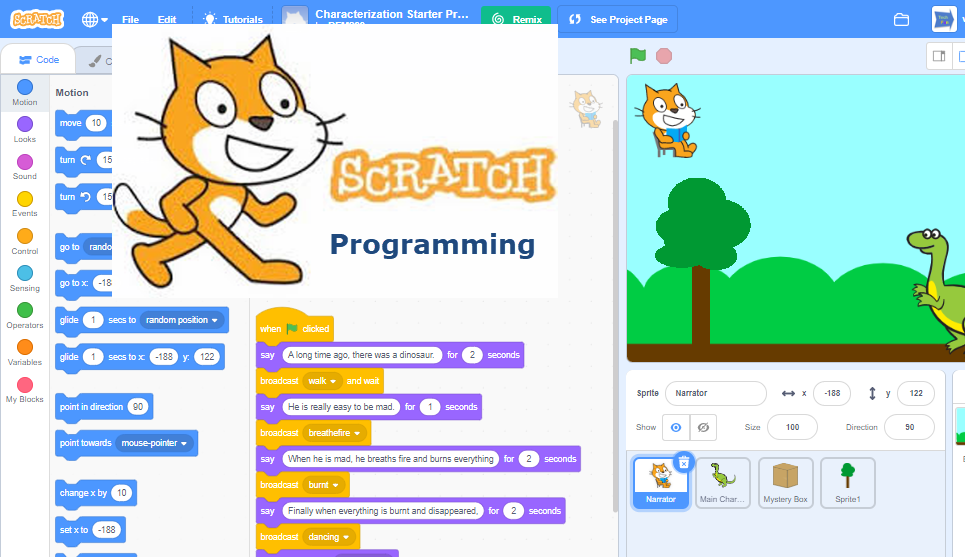

[index](../index.html)

# Lesson 1: Welcome to Scratch

Welcome, future coder! With Scratch, you can program your own interactive stories, games, and animations. Let's start our adventure!

## 1. What is Scratch?

See all the cool things you can make!

- [Watch this video to see what you can do with Scratch](http://youtu.be/-SjuiawRMU4){:target="_blank"}
- 
<a href="https://scratch.mit.edu/about?wvideo=sucupcznsp">Scratch! for About</a>

In our class, you will learn how to:

- Animate Your Name
- Make a Ping Pong Game
- Create a Music Video
- Tell a Story with Scratch
- Make a Tutorial to Help Other Scratchers

## 2. Your First Mission: Create a Scratch Account

To start creating, you need an account.

- Go to [Scratch.mit.edu/join](https://scratch.mit.edu/join){:target="_blank"}
- **Note for Parents:** Please help your child create their account. You will receive an email to activate it.
- [Reference Guide: Create a Scratch Account](./1.1_CreateScratchAccount.pdf){:target="_blank"}
  
## 3. Join Our Class Studio

Our studio is where we share our projects with the class!

- First, make sure your account is activated (ask your parents!).
- Follow the teacher's account: [weisun](https://scratch.mit.edu/users/weisun/)
- Go to our **[2025-2026 Class Studio](https://scratch.mit.edu/studios/35599270/)** and post a comment saying "I want to join."
- The teacher will invite you. You will get a message on Scratch.
- Open the message and accept the invitation. Now you can add your projects to our studio!
- [Reference Guide: Join a Scratch Studio](1.2_JoinScratchStudio.pdf)

## 4. Be a Good Scratch Citizen

The Scratch community is a friendly place. Let's help keep it that way!

- **Be Respectful:** Be kind and thoughtful when you comment on other people's projects.
- **Be Constructive:** When giving feedback, say something you like and offer a helpful idea.
- **Share:** You are encouraged to share your projects. You can also "remix" other projects to build on their ideas (Scratch will give credit automatically!).
- **Keep Personal Info Private:** Don't use your real name or share personal information.
- **Be Honest:** Be a good community member.
- [Read the full Scratch Community Guidelines](https://scratch.mit.edu/community_guidelines)

## 5. Your Second Mission: Scratch Surprise

It's time to create your first project!

- Click "Create" in Scratch to start a new project.
- **Challenge:** Can you make the cat sprite (the character on the screen) say "Hello"?
  - *Hint: Look in the "Looks" blocks.*
- Explore! Try clicking different blocks and see what they do. Snap them together like puzzle pieces.
- [Reference Guide: Scratch Surprise](./1.3_ScratchSupprise.pdf)

## 6. Have Fun and Explore

See what other students have made and get inspired!

- **[2025-2026 Coding Class (Our current class)](https://scratch.mit.edu/studios/35599270/)**
- [2023-2024 Coding Class](https://scratch.mit.edu/studios/33828217/)
- [2022-2023 Coding Class](https://scratch.mit.edu/studios/32056209)
- [Older Class Projects](https://scratch.mit.edu/studios/25368240)

**Fun Games to Try:**

- [Snake](https://scratch.mit.edu/projects/3306784/)
- [Flappy Bird](https://scratch.mit.edu/projects/127736058/)

**Find More Projects:**

- [Explore all projects on Scratch](https://scratch.mit.edu/explore/projects/all)
- Share your favorite project with the class!

---
[Next Lesson: Get Started with Scratch](./02.Get_Start_Scratch.md)

