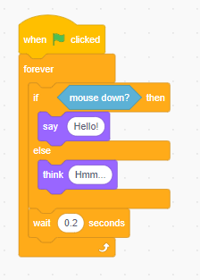

# [Lesson 2] Get Start Scratch

## 2.1 About Scratch

### 2.1.1 Learn Scratch

- To learn what is scratch, please view:  [Introduce scratch](01.Introduce_Scratch.md)
- If you have no experience of Scratch, please start from[Get start of scratch tutorial](https://scratch.mit.edu/projects/editor/?tutorial=all)
- More scratch tutorial on ["Collection of Coding Cards"](https://resources.scratch.mit.edu/www/cards/en/scratch-cards-all.pdf)

### 2.1.2 Scratch practices

- [10 blocks](./2.10blocks.pdf)

## 2.2 Control and condition

### 2.2.1 Loop

- [repeat](https://en.scratch-wiki.info/wiki/Repeat_()_(block))
  - when you need do the same actions multiple times
   

- [forever](https://en.scratch-wiki.info/wiki/Forever_(block))
  - when you want repeat do something endless
   
  - use wait to slow down the loop
  - use 'say' or 'think' block to display the loop

### 2.2.2 Condition

- [if then](https://en.scratch-wiki.info/wiki/If_()_Then_(block))
  
  
- [if then else](https://en.scratch-wiki.info/wiki/If_()_Then,_Else_(block))
  

- condition loop : [repeat until](https://en.scratch-wiki.info/wiki/Repeat_Until_()_(block))
  

- use "[wait until](https://en.scratch-wiki.info/wiki/Wait_Until_()_(block))" to pause the forever with condition
  

- stop the forever loop
  

### 2.2.3 practice loop and condition

Practice scratch to satisfy below condition

- if you press the mouse key, the Cat in the stag keep spinning
- if you release the mouse key, the cat will show next customer every 1 s

## 2.3 Animation in Scratch

### 2.3.1 Animation with sprite from library

- Sprite

### 2.3.2 Drawing your costume

- Draw with Bitmap
- Draw with Vector
- the different of Vector and Bitmap

### 2.3.3 Animation with code

- move location
- change color and other graphic effect
- turn
- change size

## 2.4 Scratch practices  and project

### 2.4.1 Practices

- Simple animation in sprit [Build A Band](./3.1.buildABand_v2.pdf)
- Animation with Drawing [Orange Square Purple Circle](3.2.OrangeSquarePurpleCircle_v2.pdf)
- Animation [It's alive](3.3.ItisAlive_v2.pdf)
- Animation with music [Music video](3.4.MusicVideo_v2.pdf)

### 2.4.1 Project of this class

- Base on the  [about me](./2.3AboutMe.pdf)
- Build a Scratch project to introduce yourself.
- Make sure need use all different types of Animation in scratch
- Make sure use Condition and loop in you project
  