# 3 Variables in Scratch

## 3.1 Define and View Variables

The simple example of variables is a box with number in it. and the number can be increased and decreased and changed by your scratch block.

### 3.1.1 Build in variables

There are many variables in Scratch you are using in scratch programing.

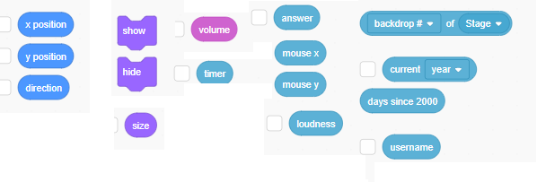

- Some variable Like x position anv size , you could see their value by click the sprite:
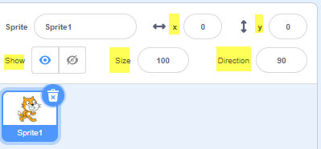

- Some variable you have to use a block to display them
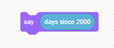

- Some variables are used inside scratch, they were hidden from you.
You could see the color change, and you cold change the color, but you can't see the color variable's value
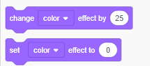

### 3.1.2 Create you own variables

There is section for variables in scratch for you to create your own variables.

## 3.2 Scope of Variables

Use the Make Variable box you could create a new variable
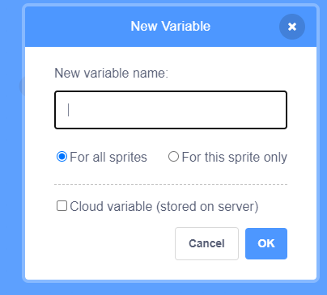

And you could see there are some different options

- For all sprite
  During your project running, it will has only one value for you project
- For this sprite only
  If you use clone to create multiple instance of the sprite, each has it's own value.  
  example, the size,x,y of the sprite.

- Cloud variable (stored on server)
  For this, the value will shared by all player who run your scratch project.

## 3.3 Type of Variables

- Numerical
  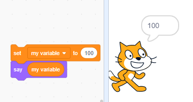
- [String](https://en.scratch-wiki.info/wiki/String)
  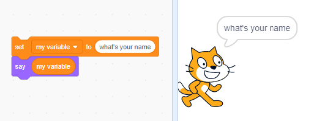
- [Boolean](https://en.scratch-wiki.info/wiki/Boolean_Block)
  The boolean value is "true" or "false", but it is hidden from you.
  you could use it with Sensing and Operators block
  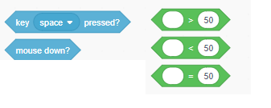

## 3.4 Operators

- Numerical Operators
  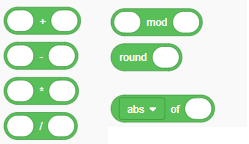
- Numerical example
  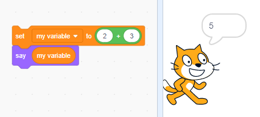
- String Operators
  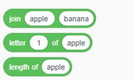
- Build String example
  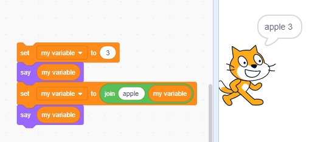

## 3.5 Set Variable value from input

- You could ask the play input the variable value, and assign to the varialbe you want to keep the value
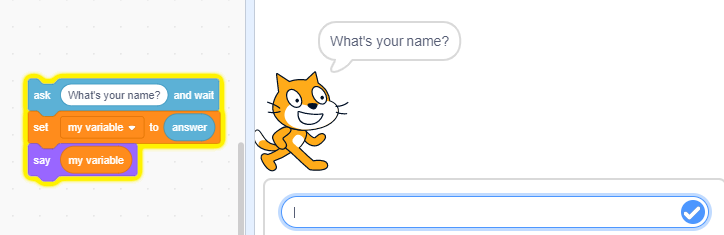  

## 3.6  Project of Class

Build a scratch project, let user input some info, and your project will run base on user's input.

- Ask Player Name and Birth date with Year, Month, Day
- Calculate the Player's age, and say "Hello [name], you are [xx] years old! "
- hint: use [Current block](https://en.scratch-wiki.info/wiki/Current_()_(block))
- optional: if today is player's birth day, show animation of happy birthday
- optional: Show the player's chines zodiac
- optional: show the player's western zodiac info

## References

- <https://www.codingkids.com.au/coding-tips/variables-and-how-to-use-them-in-scratch>
- <https://en.scratch-wiki.info/wiki/Variables_Tutorial>
- Chinese Zodiac <https://www.travelchinaguide.com/intro/social_customs/zodiac/>
- Western Zodiac <https://www.travelchinaguide.com/intro/astrology/western-zodiac/>
  