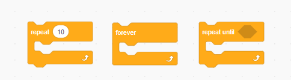
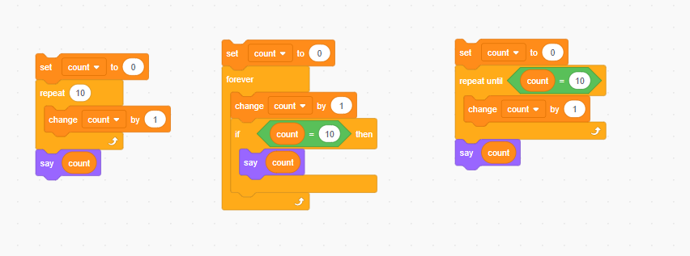
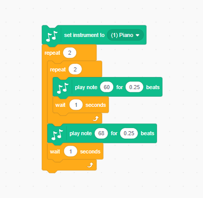
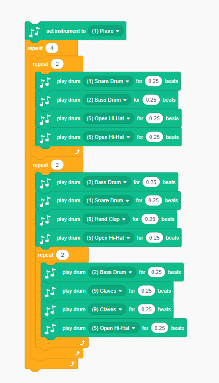
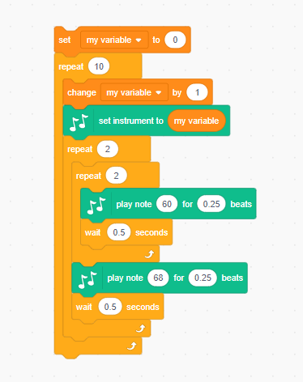
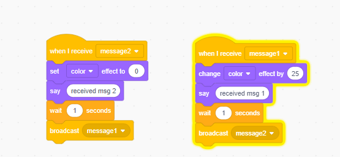

# 04 More Loops

Loop in programming is repeat run some code until a certain condition is reached.
If there is not condition for exit the loop, it's infinite loop.

## 4.1 Scratch loops type

There are 3 looping blocks in scratch "Control" section:

The first looping block will run the giving number of times.
The 2nd looping block will keep running until you stop the scratch.
The 3rd looping block will keep running until the condition block you giving is satisfied.

Many times you could use any of the blocks to do same action, for example, count to 10 and stop.

Upper examples using 3 different types to do add the count 10 times and print out the value.

## 4.2 Double loops

You could put a loop outside a loop.

And you could have a loop block outside of multiple loops

### 4.3 Triple loops

You could have 3 layer of loops,  below example play same notes with 10 different instrument:

### 4.4 Other looping without loop blocks

There are many way to cause loop even you don't want to, example, if you send message and received message in two sets of blocks like below

## 5  Practices

- Add 1 to  "my variable" 100 times. ([answer of practice-1](./05.01-practice-1.png))
- Add the number 1 to 100 and say the sum. (1+2+3+.....+100=?)([answer of practice-2](05.01-practice-2.png))
- Add all the odd number from 1 to 100 and say the result in screen. (2+4+6+...+100)
- Use loop and music block composite a music piece.
  