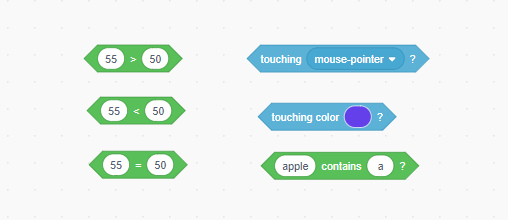
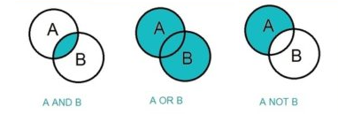
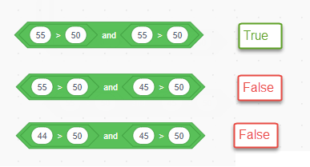
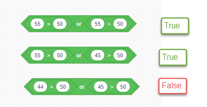
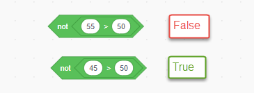

# 5 More conditions

## 5.1 Boolean Type

In computer science, the Boolean data type is a data type that has one of two possible values which is intended to represent the two truth values of logic and Boolean algebra.


## 5.2 Scratch Boolean blocks

There sre some base boolean blocks in scratch you already know how to use



## 5.3 Boolean operation blocks

Below is the boolean operation blocks



### 5.3.1 And

for `And` block, must be both side is `true`, the block value is true:



We could make note of above blocks as express:

```python
  (55 > 50) And (56 > 50) => (True) And (True) = True
  (55 > 50) And (49 > 50) => (True) And (False) = False
  (45 > 50) And (49 > 50) => (False) And (False) =False
```

### 5.3.2 Or

For the OR, any one side is true, the block value is true



```python
 (55 > 50) OR (56 > 50) => True OR True = True
 (55 > 50) OR (49 > 50) => True OR False = False
 (45 > 50) OR (49 > 50) => False OR False = False
```

### 5.3.3 Not

For the `Not`, it will reverse the value, if Not(True) = False



```python
Not (55 > 50) => Not True = False
Not (45 > 50) => Not False = True
```

## 5.4 Boolean Practice project

- please remix the [project](https://scratch.mit.edu/projects/437018711) and completed below
- 1. Click the red ball or green ball to hide it.
- 2. if green ball touch green bar got 1 p
- 3. if green ball touch red bar lose 1 p
- 4. Red  ball touch red ball got 1p
- 5. Red touch green ball to lose 1point
- 6. Any ball touch  yellow bar will lost 1 p
- 7.  Any ball touch purple bar will got 1p
  
## 5.5 example of Boolean

Shark demo  <https://scratch.mit.edu/projects/432203048>