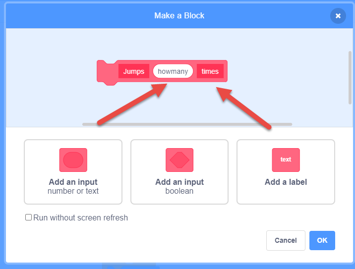

# 6 Functions (My Blocks) 

## 6.1 What is functions

A function is a block of organized, reusable code that is used to perform a single, related action. Functions provide better modularity for your application and a high degree of code reusing. 

In Scratch, "My Blocks" could let you define your own blocks with existing scratch blocks.

In the My Blocks section,  Before any blocks are created, it is empty, except for a "Make a Block" button.

## 6.2 Create a Customer block

When Click the "Make a Block" button, you will see the dialog of create block

For example, input "Jump" as the block name, and build a simple jump block in the sprite:

And you could reuse the jump block when you need in this sprite:

And you could make your block call your customer blocks, for example, make another block call "doubleJump":

## 6.3  Pass data to blocks (Arguments and Parameters)

Some time you want to pass some data to your block, for example, you want to tell your Jump block how high to jump or how many times to jump.
The data you passed to block is call "Arguments" out side the block, and "Parameters" inside the block

Let's build a "Jumps" block that could take a number of jump you passed in.

- add an input (number or text), name it "howMany",  and add another label after call times,  so the function looks like "Jump (howMany) times"
  

- Add code for jumps like below
  function looks like "Jump (howMany) times"
  

## 6.4 Blocks with multiple parameters

Let's build a "Jumps" with two or more parameters.
You could pass two number, "how many" and "how hight" the the Jump block.

## 6.5 A Block call it self  "Recursion"

If you make a block call it self in the block, it will cause infinity loop, like this will jump forever:

Usually a Recursion function we need give a condition to let it stop:

## 6.6 Project, Utilize Make block

- make a new project or update your old project
- Use Make a Block in your project
- User Make a Block with Number or Boolean input in your project