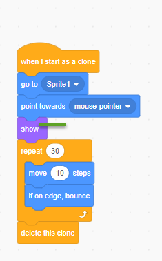

# 07 Create instances with Clone

## 7.1 Cloning and Clone Blocks

### 7.1.1 Cloning

Cloning is a feature that allows a sprite to create a copy of itself while the project is running. Each clone has the same costumes, sounds, scripts, and variables as the original but is otherwise independent.

From Scratch 3.0 ,one project may only be 300 clones at once to prevent excessive lagging or crashes.

### 7.1.2 Clone Blocks

There are three blocks related to cloning, all could be found in the control palette.

Below is a example to use clone to fire balls

- First, in the sprit where the ball fire from add below:

- Then in the ball, make it hidden, add code like below 

check the [clone example here](https://scratch.mit.edu/projects/443642866/)

## 7.2 Local Variables of Clone Sprite instance

When you have many clones, you may want give them a number as ID to make them different.
We need user Variables

- Create a private variable MyId

- Create a global variable clone count and you will got two variables

- Use below code to give each clone a ID

Check [the 2nd clone example here](https://scratch.mit.edu/projects/443647392/) 

## 7.3 Sharing Clone Data

Some time you want share a data from a clone to other clone.
For example if you want each clone of cat could fire a ball, you need share the position the the clone to the ball sprite.

- Create two global variables startPosX and startPosY

- Before create clone of ball, set the startPosX and startPosY

- Change the Ball clone start position before animation of the clone

check [the 3rd clone example here](https://scratch.mit.edu/projects/443649162/)

## 7.4 Projects

- Another simple clone example <https://scratch.mit.edu/projects/632690390/>
- Make a tower that could fire balls
- when you mouse click the tower will make the clone of ball and move forward to the mouse click point
- Use clone to create 10 bugs will move toward the tower
- When the ball hit the bug will kill the bug
- make the game as funny as you can
