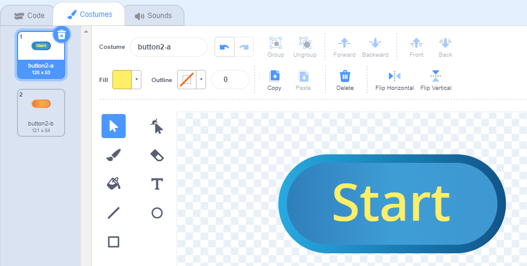

# 8 Events

## 8.1 Event Driving Programming

Event Driving Programming is programming n which the code is based on events.  

For example, the program could detect the user actions such as "a mouse click" and "Key pressed", or a sensor output,  or a message from other programs.  when those events be received, the programming will run or doing something.

In scratch, The Events related blocks are blocks with "When .."  and the message broadcasts blocks.

You already know all sprits could triggered by the Events of "When Green flag click"  "When Key pressed" "When the sprits clicked".  Those are build-in events blocks.

Next we we lear how to build custom event with message broadcast block.

## 8.2 Broadcast message block

We can build a "Start" button:

And put when the sprite clicked and broadcast message to it.

Name the new message "StartGame".

The final code of StartGame button

And you could have multiple sprites to take action by the "StartGame" event

see the example <https://scratch.mit.edu/projects/446689602>

## 8.3 Broadcast message and wait block

This block also send message out, but it wait all receiver finish the running and continue the next.

Make a button "let's dance"

Add code let the cat dance for some time

The button will hidden after click, then send broadcast message.
But the next code after will not run until  the received code completed, Then It will run next block after broadcast again again.

check the example
<https://scratch.mit.edu/projects/446699823>

## 8.4 Multi-threading

Add another sprite in previous project, to receive the dance event.

And you could use a variable to control other sprits action.
See example:
<https://scratch.mit.edu/projects/446703100/>

## 8.5 Project

Make a game using custom event and message broadcast.

- Create a new or remix an old project
- Create start button, and start flash sprite.
- hidden the start button after start be clicked, and make game playable.
- make all sprite show or start action base the the start event.
- Add the stop or game over event to stop all sprite.