# 09 List of Variables

## 9.1  What is List and List Blocks

A [list](https://en.scratch-wiki.info/wiki/List) (also called an [array](https://en.scratch-wiki.info/wiki/Array) in other programming languages) is a tool that can be used to store multiple pieces of information at once. It can also be defined as a variable containing multiple other variables. A list consists of a numbers paired with items. Each item can be retrieved by its paired number. List blocks can be found in the Data blocks palette.

[List blocks](https://en.scratch-wiki.info/wiki/List_Blocks) are subcategory of the [variables blocks](https://en.scratch-wiki.info/wiki/Variables_Blocks) ([03.Variables.md](03.Variables.md)) group.

The floowing blocks can be used to program lists
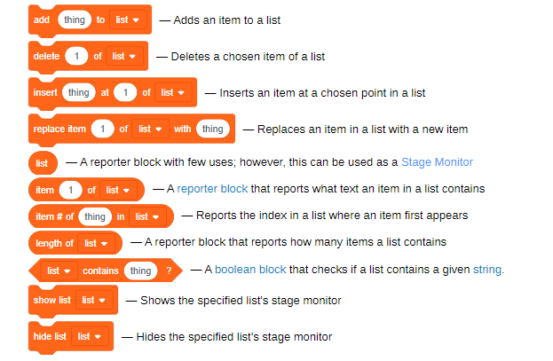

## 9.2 How to Create a List

When you create "Make a List" button, it will let you create a list. and you could Rename or Delete the List br right click the list item or from and list blocks dropdown.

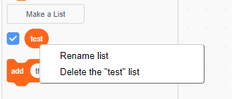

## 9.3 Operate Items in list

Then you could add item to the list, and read or delete it.

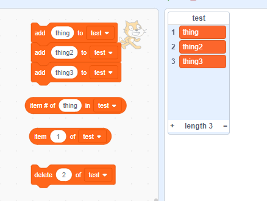

The Item # is the index of list, in Scratch it start from 1, but in other language, the index of array of list usually start from 0.

## 9.4 Example of use List

Here is a example of use list: <https://scratch.mit.edu/projects/449803319/>

You could place note values in the list by order, then get the value by call "`item {#} of {ListName}`"

Use the `repeat` box and use `Length of {notename}` with an addition variable, you could play all the item in the list with the order.

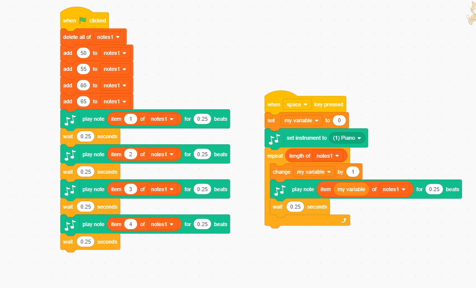

## 9.5 Project of using list: Following star

Below will show you have to make a following star project like <https://scratch.mit.edu/projects/378543061/>

### 9.5.1 Create a Magic wand follow the mouse.

Create a magic wand, and let it always same position as you mouse

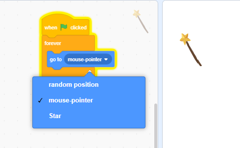

### 9.5.2  Add a Star to follow the mouse

Chose a Star from library, make it follow the mouse like below:

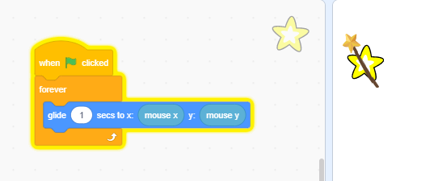

### 9.5.3 Add clones of star, all follow the mouse

Add clone to star, code like below
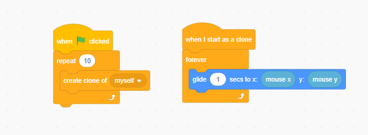

the step 3 example is like <https://scratch.mit.edu/projects/378535132>
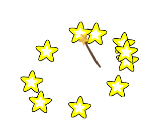

### 9.5.4 Add two list for position X and Y

Go to variable, Make two lists name positionXs and positionYs:
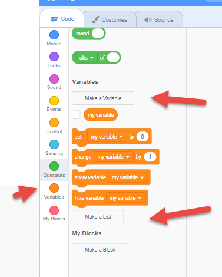
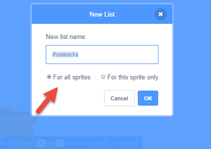

Then you will see two list show in the left panel variable section and you could make it display or hidden from stage
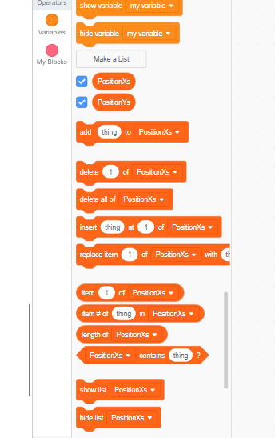
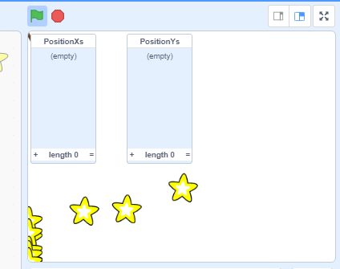

### 9.5.5 Set the first position and let Star follow

We will change the star from follow the mouse to the position of the wand. To do this, we need add code wand to set the x,y value to the two list.

Check below, we had the initial block, always delete all items in lists. and set the initial position to the PositionXs and PositionYs.
also, keep replace the first item in the PositionX and Y with the mouse x,y
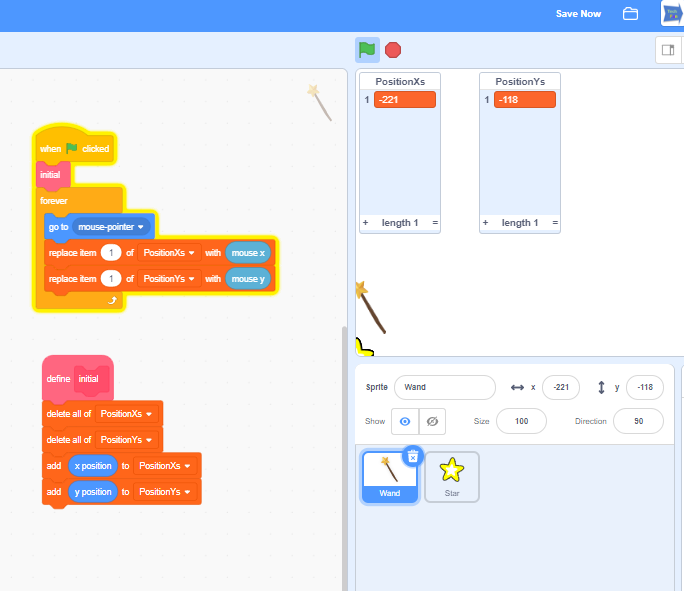

In the Star,  change the star to follow the first item of the x and y list.
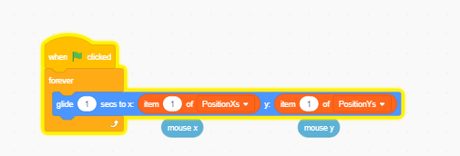

### 9.5.6 Initial the Star clone

Add a variable for count of star clones, and give each of star a number as index or Id

- create a variable for count the star clone
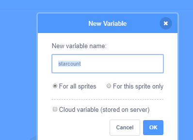

- for each star clone, create a private variable `myIndex` 
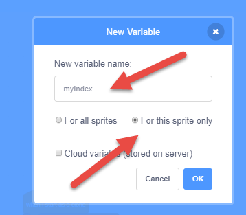

- use blow code make each clone use the value from list.
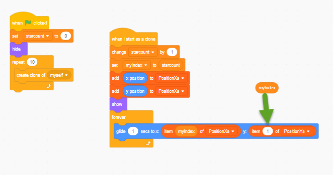

### 9.5.7 Make each Star set the position for next star to follow

In Star sprite, create a block name SetNextPosition, and call SetNetPosition before it start to moving:

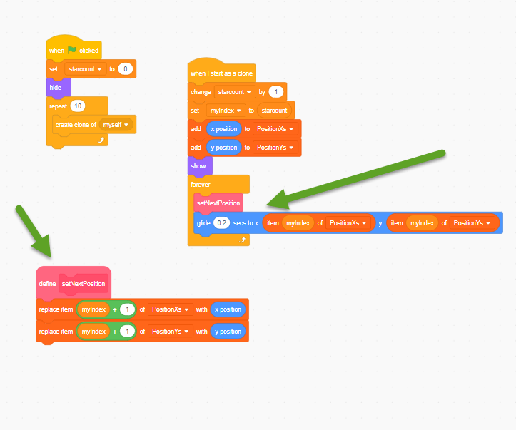

### 9.5.8 Done, but test and make it work better

OK, try the and think about how to improve it, and what kind of game could use the List.
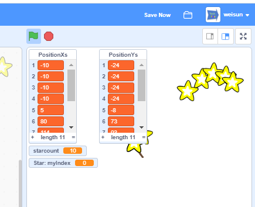