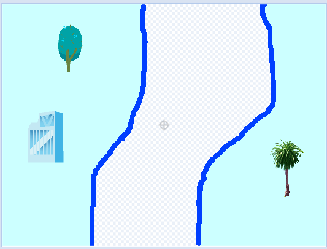
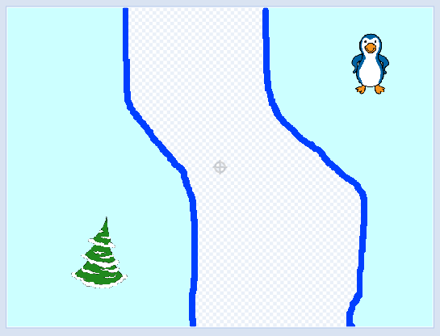
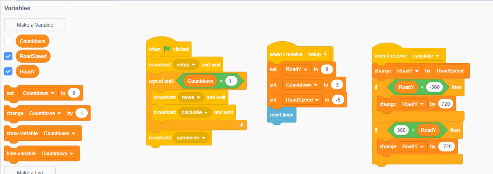
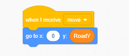
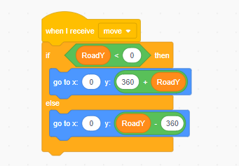
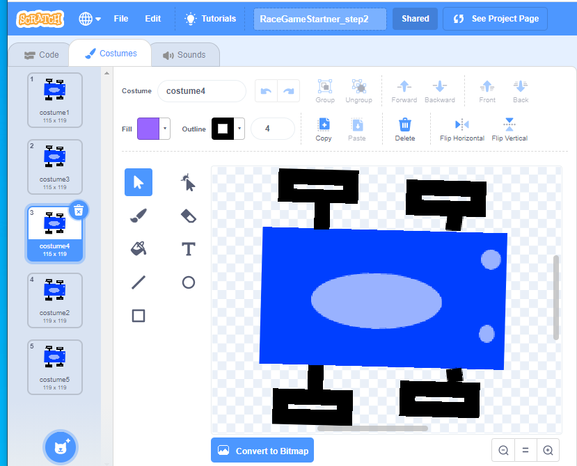
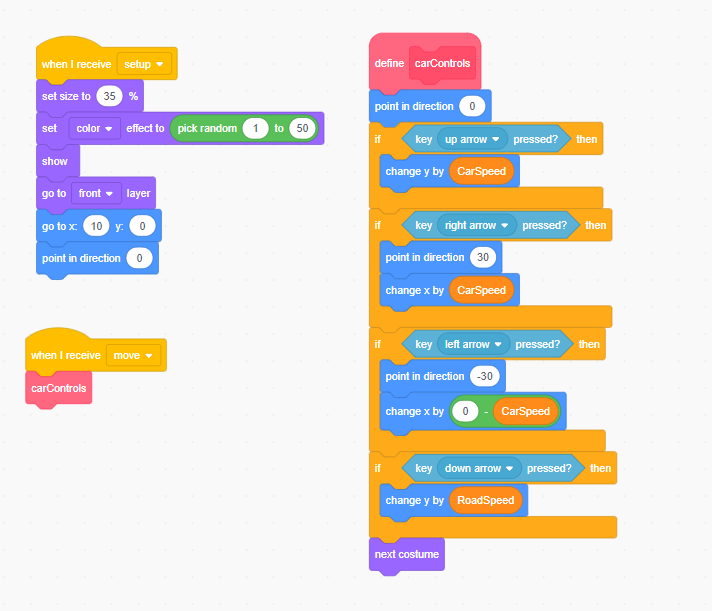
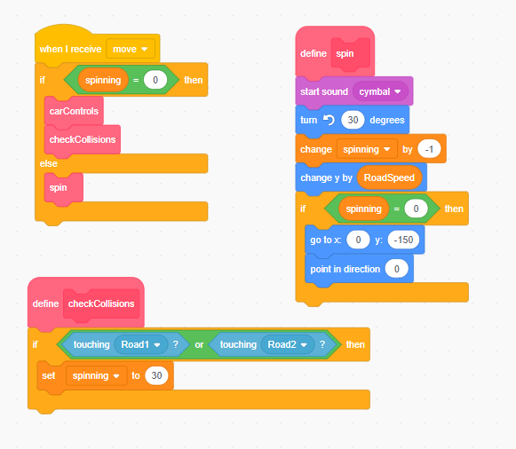
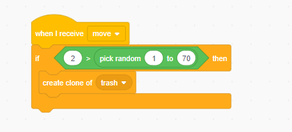
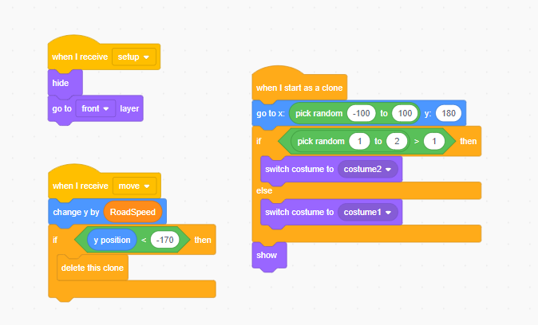

# 10.10 Race Game

## step 1: Draw the two picture of road

<https://scratch.mit.edu/projects/214754262>

Draw one map first, copy to another sprite then flp vertical.

Add below code in Stage

RoadY, is the variable of position the road map use to set location.
RoadSpeed, is how fast the RoadY be change
CountDown, is the life of the car

Event Move will be received by road maps
Event calculate, it will check if the Reset the road mps to the top again.  

RoadMao1 will use the variable RoadY as it y location

RoadMap2 will be either on the top of RoadMap 1 or bottom of RoadMap 1

## step 2: Add Vehicle

<https://scratch.mit.edu/projects/214754280>

Draw a car and make multiple costumes

Initialize the car and add move control

## step 3: Add Car Collisions

<https://scratch.mit.edu/projects/214754303>

## step 4: Add obstacles

<https://scratch.mit.edu/projects/214754331>

Create sprite Trash, and set it be random showup

