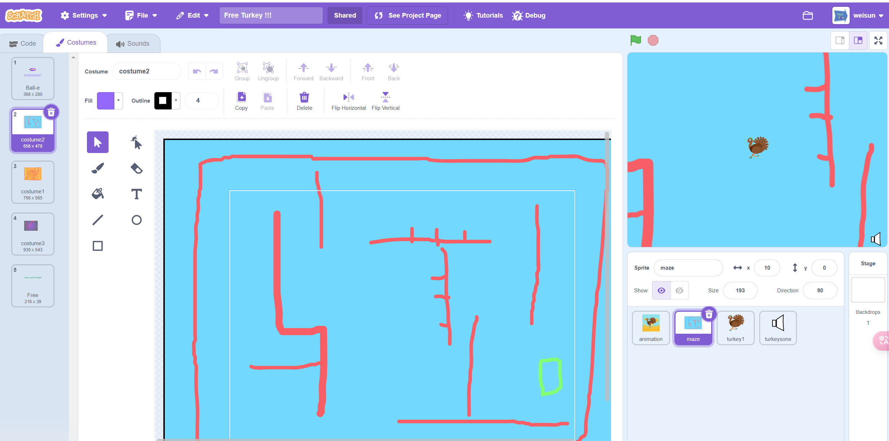

# Big Maze (free turkey game) ) 

## Draw a big maze map first
- Draw a block bigger than the stage
- your stage view size is 245x185,  so you can draw a block up to 720x540

- or you can draw a maze with a smaller size, but you need to adjust the sprite size and the maze size in the code

## Player Move
- The Character actually not move, the maze move instead.
- The character always stay in the center of the stage

https://scratch.mit.edu/projects/604646992

## The Fence

- The fence is the wall of the maze, the character can not touch the fence

## the Door
- The door is the exit of the maze
- When the character touch the door, it will go to the next level.

## Tyr the Game
- [Free Turkey](https://scratch.mit.edu/projects/604646992)