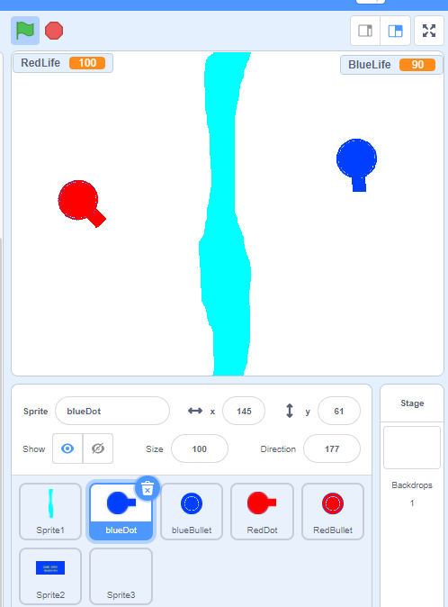
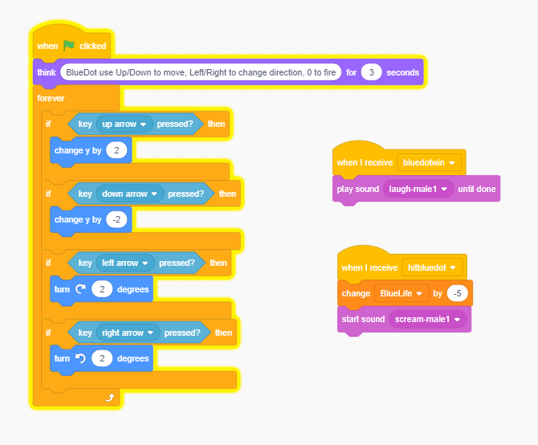
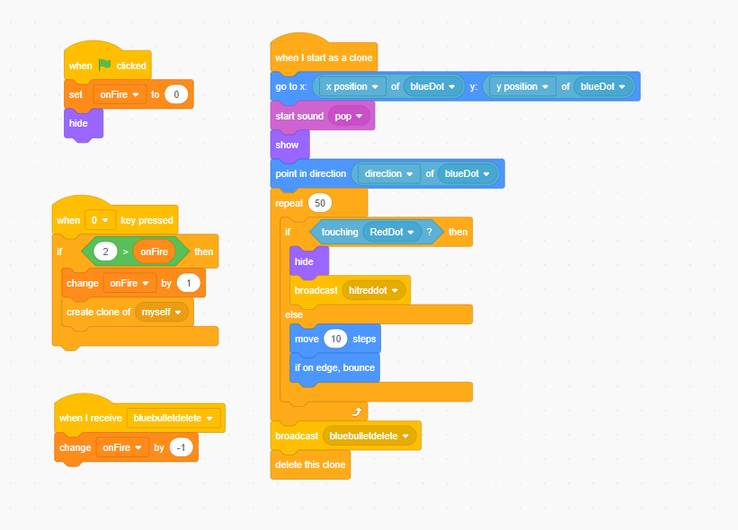
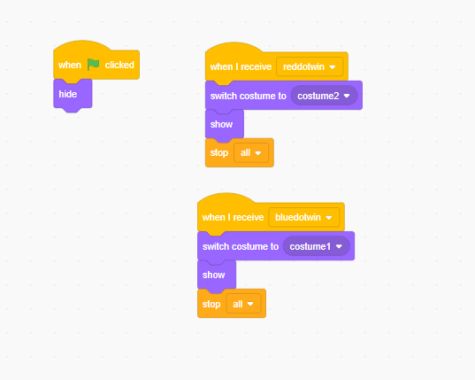
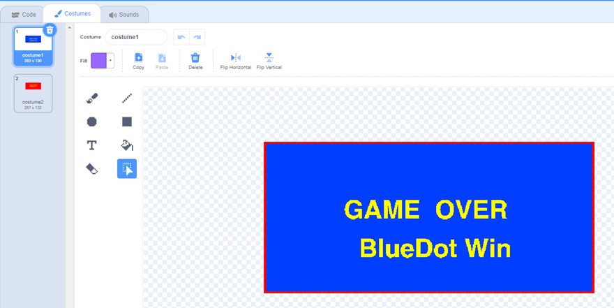

# 10.11 Two Players Game

## 1 DotWar Game Starter

This is a example of game that let two players share same keyboard to play together.
We could use WSAD and space for one player and Arrow key and one key nearby for another player
<https://scratch.mit.edu/projects/147879455/>

## 2 Basic control of player

Below is the code example of blue player, it has moving and direction control and received event for change life and play sound

## 3 Bullet code

Below code os of bullet, it only could have one bullet in screen.
it use clone and will delete it self after 50 moves.

## 4 Game Over

Build two customer in gameover sprite, and show who is win.

## 5 what's more kind of two player games

- ping pong <https://scratch.mit.edu/projects/14284722/>
- Bodge Blob <https://scratch.mit.edu/projects/404677815/>
- Quality Platformer <https://scratch.mit.edu/projects/476722293/>

## 6 one play play two play game

- could you make a AI player to play with you ?
