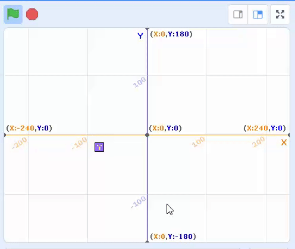

# 10.12 Step by Step to build a snack game in Scratch

## 10.12.1 Step 1: Crate looping moving snake head

<https://scratch.mit.edu/projects/497574292/>

## 10.12.2 Step 2: Snake food random location

<https://scratch.mit.edu/projects/497579325>

## 10.12.3 Step 3: Snake body x,y positions list

<https://scratch.mit.edu/projects/497596710/>

- initial the first body position from the snake head

- the first body created from clone, and set its current position to next body position

## 10.12.4 Step 4: Sync the snake bodies moving

<https://scratch.mit.edu/projects/497600348>

- snake head broadcast move event

- snake body clones update position when received move event
  

## 10.12.5 Step 5: Finish the game

<https://scratch.mit.edu/projects/497616931/>

- Add code for game over when snake head touch the snake bodies
- Update move control not point to backward
- Add background music and sound effect
- improve graphic
- Add score and max score 
