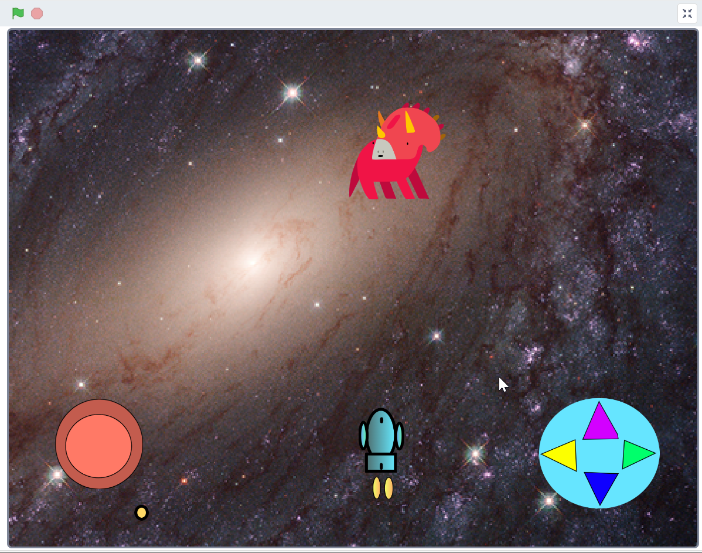

# 10.13 Build your own space shooting game

## 10.13.1 What need in a space shooting game

### 1. Moving game objects using the keyboard or mouse

1. Define how your spaceship movement, and create code for it.
2. you could use WASD key or arrow keys or mouse position. 
3. or use joystick for iPad control (see example)

### 2. Clone the bullets or missiles when fire

1. Chose some keys for fire the bullets.
2. When fire key pressed, clone the sprite of bullet, and make it move toward one direction.
3. Deleted the bullets clone after moving some distance.

### 3. Enemies

1. Use clone to create enemies,
2. chose your own image for enemies,
3. The enemies move and coming  could be random or with pattern.
4. Delete the Enemies clone when collisions or reach the end.

### 4. visual and sound effect of game object collision

1. Add explosion animations.
2. Add fire sound and explosion sound
3. Add background sound

### 5. Tracking game scores and communicating message between game object

1. Life/healthy of your spaceship.
2. Earn scores when you hit the enemies.

## 10.13.2 Build you own game

Please follow upper guideline to build your own game base your understood.

## 10.13.3 Example

<https://scratch.mit.edu/projects/826032099/>

## 10.13.4 What's you can remix and add more

-  Add more enemies
-  Add more score and levels and leaderboard
-  Add more sound effect
-  Add more visual effect
-  Redesign the spaceship and enemies
-  Add more control for spaceship
-  Add more background and music

