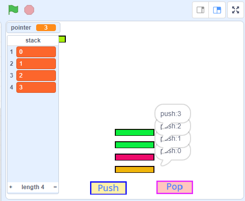

# 10.15 Data Structure - Stack

## 1. What is Data Structure

In computer science, a data structure is a data organization, management, and storage format that enables efficient access and modification. More precisely, a data structure is a collection of data values, the relationships among them, and the functions or operations that can be applied to the data.([Ref link](https://en.wikipedia.org/wiki/Data_structure))

for example, Array and List is the data structure we had used in scratch. we will introduce some more data structure

Below image come from [8 Common Data Structures every Programmer must know](https://towardsdatascience.com/8-common-data-structures-every-programmer-must-know-171acf6a1a42)

### 1.1 Arrays

### 1.2 stack

### 1.3 Queue

## 2 use scratch demo stack

Use list variable and a value variable point to simulator how stack works.

the Stack is rule is "Last in First Out"

<https://scratch.mit.edu/projects/110350786/>

## 3 Home work queue demo in Scratch

Could you build a demo of Queue:

- Use a list variable store the queue items
- Create button Enqueue and DeQueue to add item to the queue list and remove from queue list
- The rule of the Queue is 'First In First Out'
  