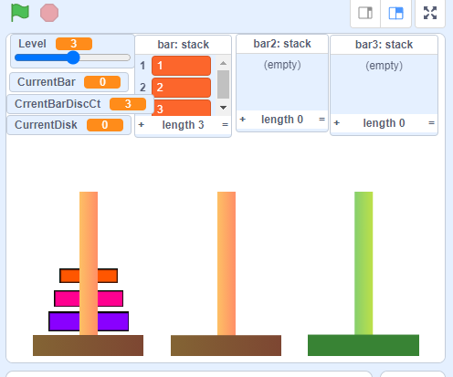

# 10.16 Stack: Build Tow of Hanoi Game

## 1 Build Tower of Hanoi Game

The Tower of Hanoi is a mathematical game or puzzle. It consists of three rods, and a number of disks of different sizes which can slide onto any rod. The puzzle starts with the disks in a neat stack in ascending order of size on one rod, the smallest at the top, thus making a conical shape.

## 2 Step by steps of build Tower of Hanoi Game

- [Step 1: init bars and disk](https://scratch.mit.edu/projects/517209359)
- [Step 2: Clone the disks and animation](https://scratch.mit.edu/projects/517229199)
- [Step 3: Add List as stack](https://scratch.mit.edu/projects/517231079)
- [Step 4: Improve the move and fix bugs](https://scratch.mit.edu/projects/517246344)
- [Step 5: Use Clone for Bars](https://scratch.mit.edu/projects/517252632)
- [Step 6: Add rule of prevent move(todo)](hhttps://scratch.mit.edu/projects/517362333)

## ref

- <https://scratch.mit.edu/projects/87006602>