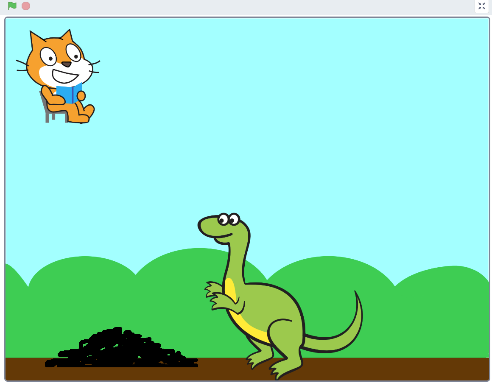
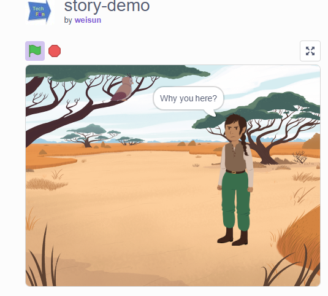

## Story type projects

### 1 Narrator story:
A narrator story is a story that is told by a narrator
- <https://scratch.mit.edu/projects/108829088>

### 2 Dialogue story:

- XiYouJi <https://scratch.mit.edu/projects/345806641/>

### 3 multiple stages story:

-  <https://scratch.mit.edu/projects/555415217/>

