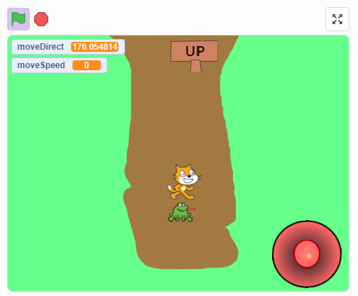
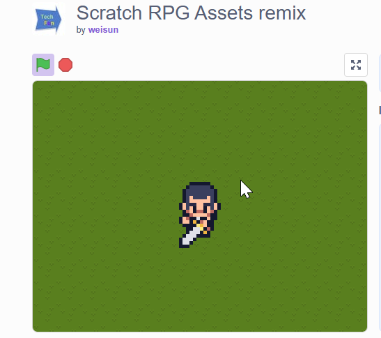

## RPG Game

RPG is a Role Playing Game. It is a game where you control a character and make decisions that affect the outcome of the game. RPGs are a popular genre of video games, and there are many different types of RPGs, including action RPGs, turn-based RPGs, and MMORPGs.

### 1 Simple RPG starter

<https://scratch.mit.edu/projects/1151223766/>

### 2 RPG Asset 

Some Asset you can used for RPG games   
- <https://scratch.mit.edu/projects/730420796>

