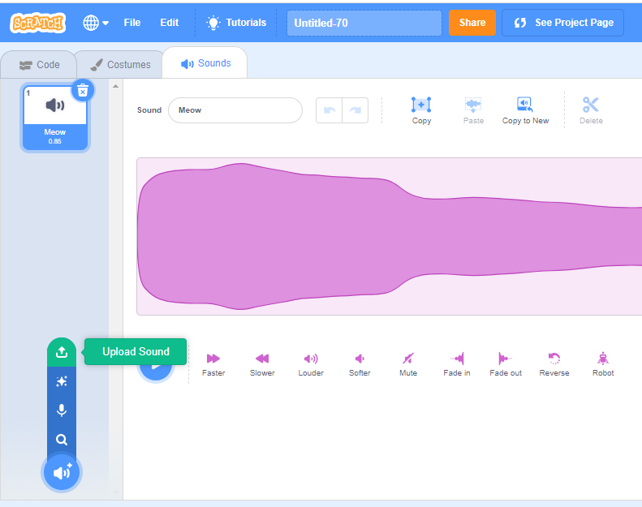

# 10-1 Project Materiel preparation

## 1 Collect music and sound

You could use google to find the music and sound resource.
Some site has the sound and music let you download for free.

Examples

- Halloween music and sound <https://spookysoundtrack.com>
- Holiday music <https://freemusicarchive.org/genre/holiday>
- Any music from Youtube <https://ytmp3.cc/>

### 1.1 download and import sound

The scratch could use mp3 or wav format of sound clip.

After you downloaded a music, it usually in the `\Download\` folder of your computer

To import sound:

To Edit the sound:

## 2 collect image and edit it

### 2.1 Find the image resources

You could use google to find image resources:
If you only need search for image, pleas click the "images" tab for images only.

some online graphic resources:

- free high quality images<https://pixabay.com/>
- Vector picture: <https://www.vector4free.com/>
- free vectors and photo <https://www.freepik.com/>
- search by name <https://www.vecteezy.com/>

The simplest way to get image is use "Same image as" from the google search result by right click the image

There are lot of image formats, Scratch could use gif, jpg, bmp, png and svg.

### 2.2 Import and Edit the images

After you save the images to you computer, you could either copy/pastes to you sprite, or import as a new sprite.

The image you just import usually has a background like below, if you set the backdrop a color, you will see that like below.

to clear the background, just need use fill to set them to nothing like below:

## 3 Build a intro animation for all your project

You could create a sprite and use it again and again in all your project, by drag it to your Backpack:

