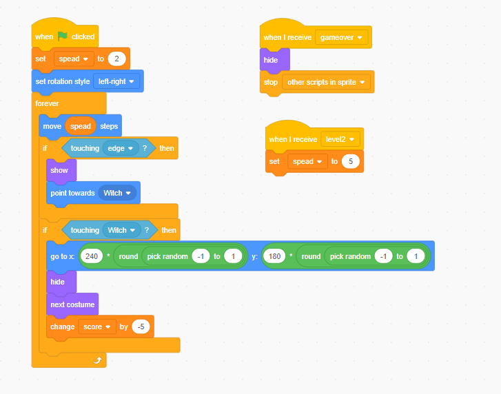

# 10.2 Holiday Theme Games

Let use the Halloween game as example to show how to build a game.

## 10.2.1 Main Character

In the Halloween Catch game, the main character is the witch.

In this sprite we

- set witch moving
- set level
- set time of game over
- set GameOver view
  

## 10.2.2 Target Items

The targe items are flying pumpkin, if witch touch it,it will hide and the player got scores.

The pumpkin you could got from google search as we learned in Chapter 10.1, and remove the the background.

- create clone of pumpkins
- make the pumpkins move from right to left with random position
- add code for collision check
- add event for level 2 and gameOver

## 10.2.3 Enemies

Ghosts are the Enemies who will make your job more difficult.

- Ghost spawn in random positions
- Ghost will move toward to your position when it spawn
- when level up, Ghost speed get faster

## 10.2.4 Examples

Holiday theme game examples could be find in below, please remix or build you own to a Christmas theme game

- Halloween <https://scratch.mit.edu/projects/127138407/>
- Christmas <https://scratch.mit.edu/projects/267036030/>
- ChinesNewYear <https://scratch.mit.edu/projects/201974851/>
- Easter games
  - <https://scratch.mit.edu/projects/406550146/>
  - <https://scratch.mit.edu/projects/417807544/>
  - <https://scratch.mit.edu/projects/103009975/>