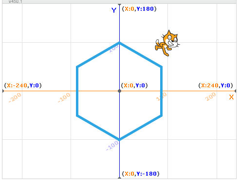
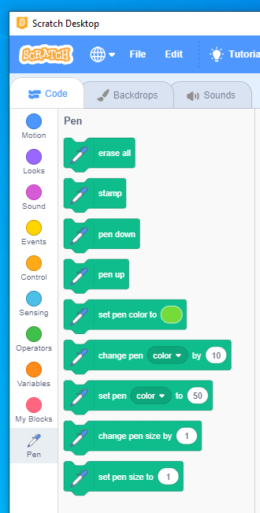
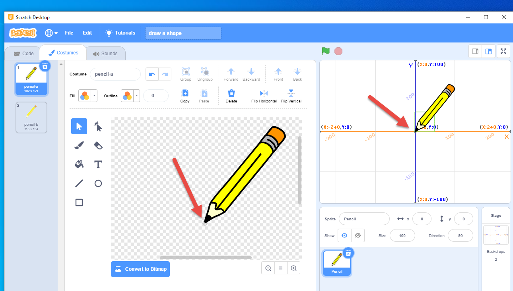
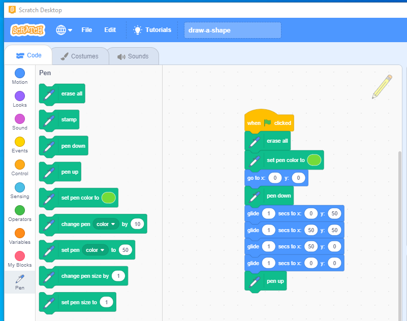
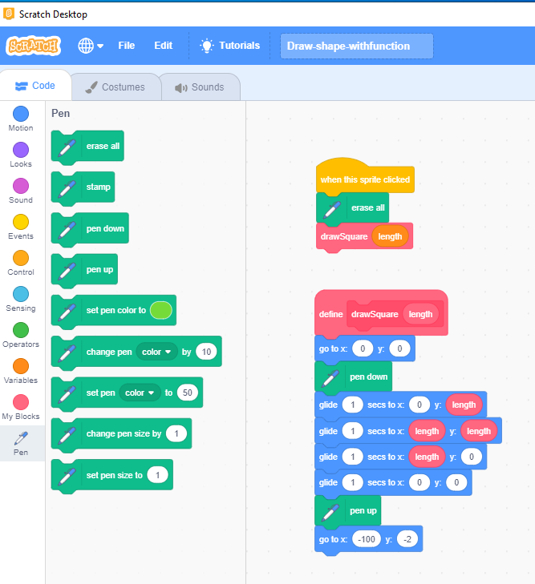
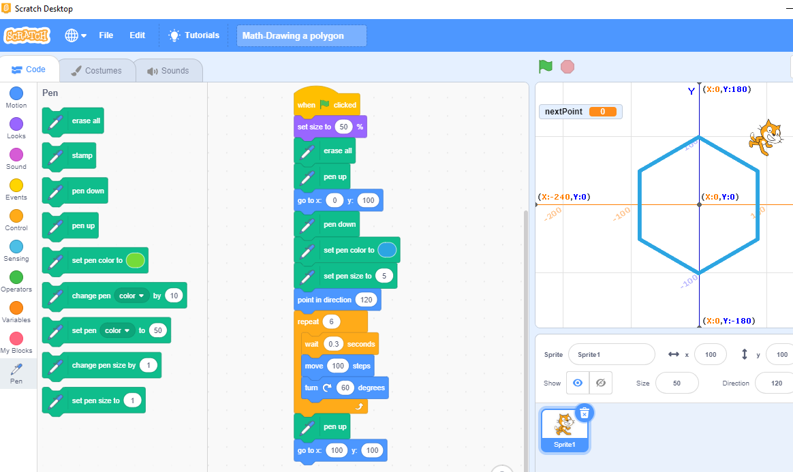
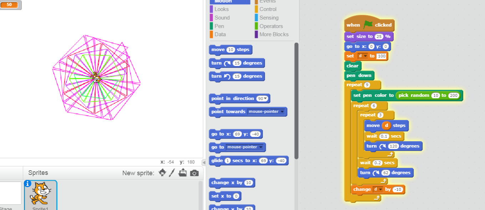
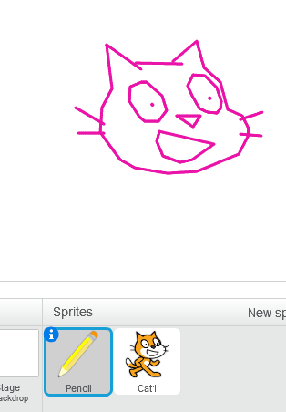

# 10.3 Pen Drawing

## 10.3.1 Understand the Coordinates

## 10.3.2 Drawing with Pen block

Use Pen Block

## 10.3.3 Drawing a shape

Drawing a square

## 10.3.4 Refactor to use function (My block)

## 10.3.5 Drawing lines practice

### 10.3.5.1 Drawing a Polygon

### 10.3.5.2 Art of lines

### 10.3.5.3 Carton Picture

## 10.3.6 Examples

- <https://scratch.mit.edu/projects/122572738>
- <https://scratch.mit.edu/projects/109473615>
- <https://scratch.mit.edu/projects/122634774/>
- <https://scratch.mit.edu/projects/651362579/>