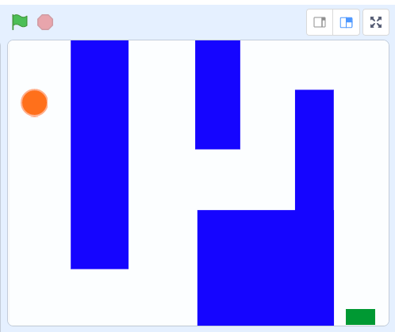
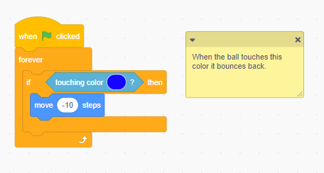
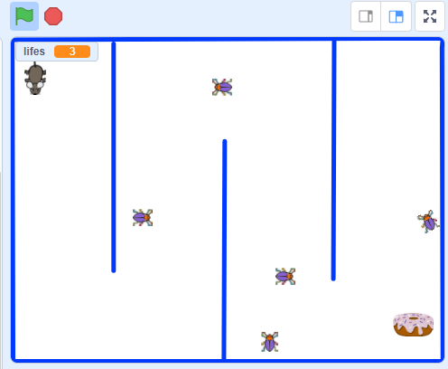

# 10.5 Maze Game

## 10.5.1  Maze game Starter

<https://scratch.mit.edu/projects/197769293>

In the Maze game starter, the orange ball could move, but it can't cross the Wall with blue color.  The code is like below:

## 10.5.2 Remix example

<https://scratch.mit.edu/projects/121920725>

## 10.5.3 Project

- Remix the game starter or the mouse and cheese example to build your own Maze game.
- Add more level and make next level more default
- Add sound and music
- Add score and game over 