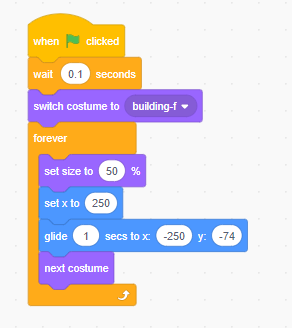

# 10.6 Scroll Game

In this project, you wil crate a game, This game include interactions between sprites, score, and levels.

The game is similar to Flappy Bird, where the goal is to keep the object from falling to the ground or touching the blocks.

## 10.6.1  The key of Scroll game: Moving Object

Please the example of below example, and check the moving background.
<https://scratch.mit.edu/projects/181469864/>

Please check the sprites the building and tree to understand how it works.

## 10.6.2 A Game starter example

see example in <https://scratch.mit.edu/projects/199117865>

First you need a controllable object

Then try to add some moving obstacles.
Object

## 10.6.3 More examples

- Flappy Bird :<https://scratch.mit.edu/projects/17828009>

## 10.6.4 More advance change

Please remix or build a new scroll game

- Make your object could fire to destroy the obstacles.
- Make more obstacles random come.  
- Make a boss and end level of the game.