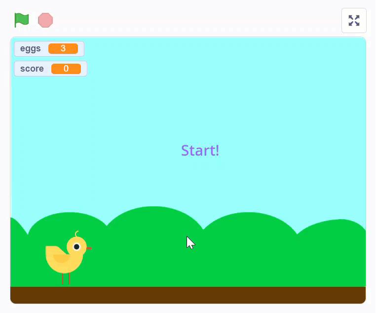
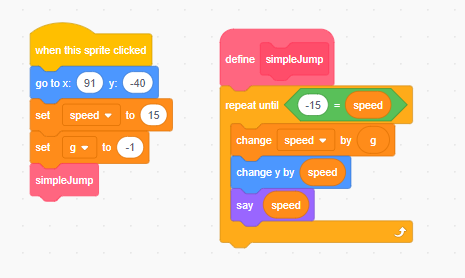
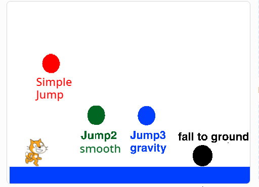
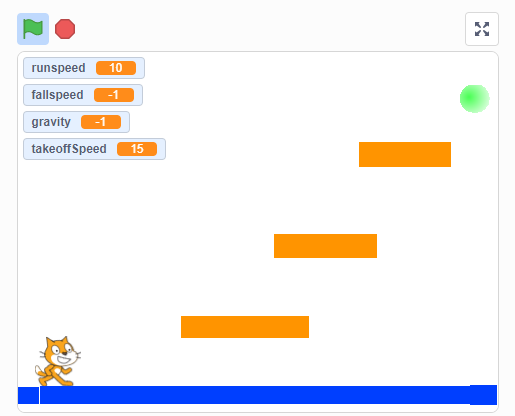

# 10.7 Jump with Gravity

## 10.7.1 Simple Jump

## 10.7.2 Simple Jump Game

<https://scratch.mit.edu/projects/416591159/>

## 10.7.3 Gravity

Gravity is the force to pull objects toward to ground.

*Velocity = -9.81 * time*

<https://scratch.mit.edu/projects/209231792/>

## 10.7.3 Jump Game Starter

<https://scratch.mit.edu/projects/140032947/>

