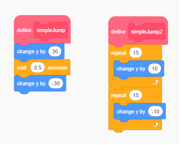

# 10.7 Jump with Gravity

## 10.7.1 Simple Jump

### Simple Jump 1
1. Define a `simpleJump` block.
2. Change `y` by 30.
3. Wait 0.5 seconds.
4. Change `y` by -30.

### Simple Jump 2
1. Repeat 15 times: Change `y` by 10.
2. Repeat 15 times: Change `y` by -10.

## 10.7.2 Simple Jump Game

### Instructions
Use the `simpleJump` block to make a chick jump over an egg.

<https://scratch.mit.edu/projects/416591159/>

## 10.7.3 Gravity

Gravity is the force to pull objects toward the ground.

*Velocity = -9.81 * time*

<https://scratch.mit.edu/projects/209231792/>

### Explanation
Gravity affects the jump by continuously pulling the object down, creating a more realistic jump effect. When an object jumps, it initially moves upward with a certain velocity. However, gravity constantly decelerates this upward motion until the object reaches its peak height. After reaching the peak, gravity accelerates the object downward, increasing its velocity as it falls back to the ground.

In Scratch, you can simulate gravity by continuously changing the `y` position of the object based on a velocity variable that is affected by gravity. For example:
1. Set an initial upward velocity when the jump starts.
2. Continuously decrease the velocity by a small amount to simulate gravity.
3. Update the `y` position of the object based on the current velocity.
4. Stop the object when it reaches the ground.

## 10.7.4 Jump Game Starter
### Instructions
View and remix the game to understand how jumping and gravity are implemented.

<https://scratch.mit.edu/projects/140032947/>

