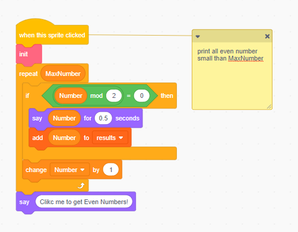
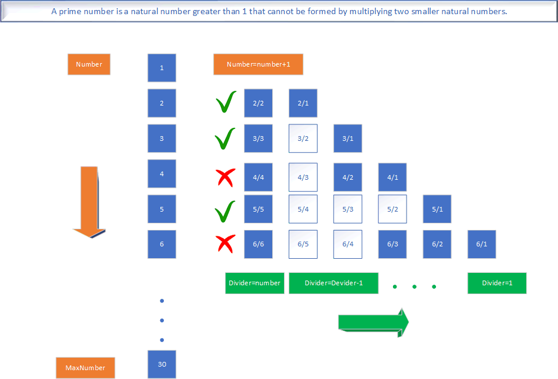
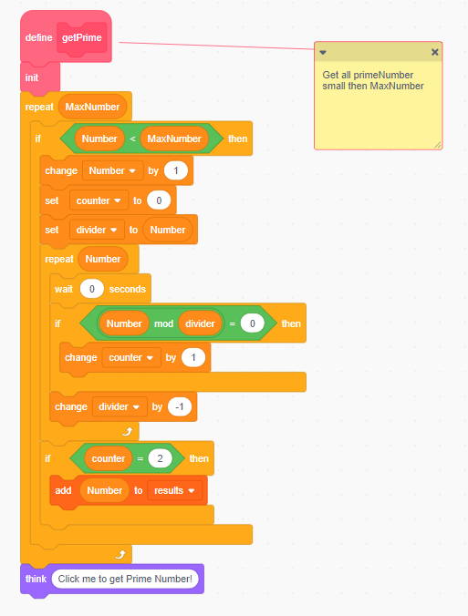
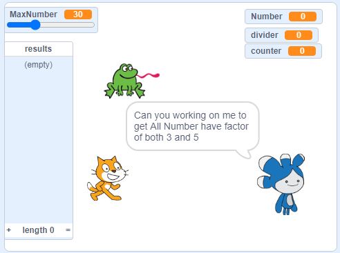

# 10.8 Math, Find Old, Even or Prime Number

<https://scratch.mit.edu/projects/481310171>

## 10.8.1 Code of Find All Even Number

## 10.8.2 Prime Number

what is prime number

## 10.8.3 Practice

<https://scratch.mit.edu/projects/481310171>
