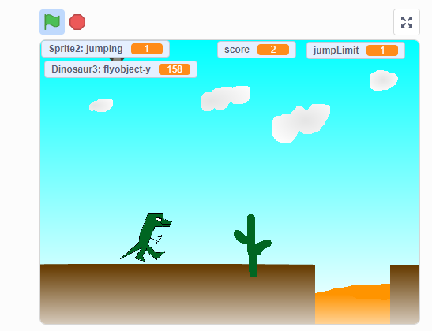

# 10.9 Platform funning game

## 10.9.1 Game Starter

<https://scratch.mit.edu/projects/216307778/>

Please check the game starter and review below key Points

- Jumping and moving control
  - gravity
  - stop when touch platform
- Platform/Ground
  - moving
- moving obstacles
  - on ground
  - on air  
- Animation
  - lava
  - Trex
- award items
- Score system

## 10.9.2 Project

Please build your own or remix the game starter

- Add more fun to play it
- fix the bugs and issue of the game
- change the image and animation in sprites
- add add more levels after reach some score
- add background music and sound effect
- any things you like
- add to the studio
