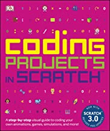
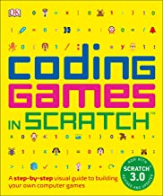
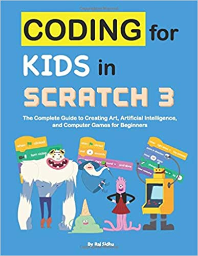

# Learn programming from Scratch (for 3-6 G)

**This class is for students of grade 3 – 6, who has no programming experience.
Students will learn through hands-on projects on classes.**

## Requirement

 Each student need  below items for this class**

1. A Laptop or iPad with at least 4G memory with internet access.
2. Another device or screen to show the zoom meeting screen.
3. An email account, (parents please set up one for your kids, and let them keep the password)
4. An account of http://Scratch.mit.edu
5. Books for reference:
   >   

## Content

1. [Introduce scratch (and Join the MLCCC Coding Class Studio)](01.Introduce_Scratch.md)

2. [Get start scratch](02.Get_Start_Scratch.md)

   - Control
     - Condition: if else
     - Loop Repeat and forever
   - Animation in scratch
     - Drawing: Vector and bitmap
     - Sprite Costumes
     - Script animation
   - project: about me
  
3. [Variables](03.Variables.md)

   - Define and view variables
   - Scope: global and local
   - Type: Numerical and String
   - Use Operators
   - Set variable value by input
   - project

4. [More loops](04.more_loops.md)
   1. Looping Types
   2. Double loop
   3. Triple loop
   4. Practice and project

5. [More Conditions: Boolean](./05.more_conditions.md)

   - Boolean Type
   - Boolean Operator in conditions
   - Project

6. [Functions (Blocks)](./06.Functions.md)
   - Defining make a block
   - Creating a Customer Block and Script
   - Passing Data to blocks
   - project
  
7. Instances (Clone)

   - Clones and Clone Blocks
   - Clones and Local Variables
   - Sharing Clone Data
   - Project

8. Events (Broad casting message)
   - Event Driven Programming
   - Broadcast Blocks
   - Broadcast and Wait
   - Multi-threading
   - Project

9.  List
    - Defining List
    - project

10. Projects
    - Holiday theme catch game
    - Drawing with rainbow line
    - Jump with gravity
    - Math with scratch" prime Number
    - Maze, two player mode
    - Dinosaur run
    - Care Race game
    - Scroll game (flap bird)
    - Snake game
    - Space shooting
    - Platform game
    - Two player shooting
    - more  
  
11. final projects
    - group project
    - Individual project

<!-- 3. Tell a story by scratch
1. How to build game in scratch
2. Build a Holiday theme game (Halloween game)
3. Build a Holiday theme game with clone (Christmas game)
4. Drawing with scratch with Pen and Script
5.  Game Programming: Catch Game(Drop Apple)
6.  Build another holiday them game (Chinese New Year)
7.  Game programming: Jump game
8.  Game programming:  Shooting Game
9.  Game programming: Race Game
10. Game programming: running game (Chrome dinosaur)
11. Using List: following
12. Math: primeNumber
13. Game Programming: Two person Shooting Game(Dot War)
14. Game Programming (Music Game)
15. Group projects(3-5week)
16. Final project (3-5week)
17. Demo -->
