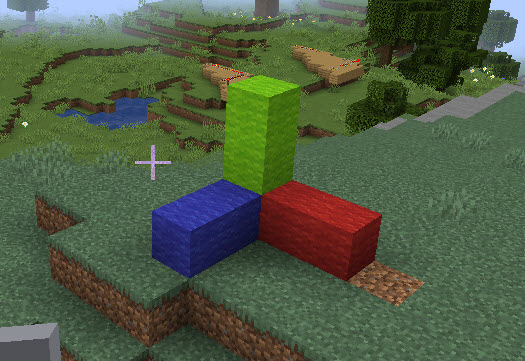
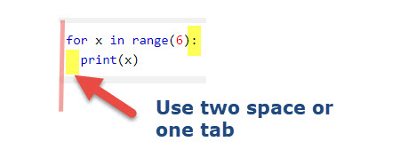

# Session 1: Get Started With Python and Minecraft

  *- have fun with programming and game*

## Session 1.2 Start Learn Programming with Minecraft

### 1. Understanding the coordinates of Minecraft

Minecraft coordinates is different than what we learn from geometry. you need keep below picture in mind when you do the minecraft coding.


#### To use below code example, please make sure use below code before the sample code.

```python
import mcpi_e.minecraft as minecraft
import mcpi_e.block as block
from math import *

address="127.0.0.1" # change to address of your minecraft server
name ="change to your user name"
mc = minecraft.Minecraft.create(address,4711,name)
pos=mc.player.getTilePos()
```

#### - [Mission-1.1] Find your location

Use mcpi module to find the position (x,y,z) of the block your player stand on.
Use Python `print` command to display your location:

```python
pos= #get your position
print("pos: x:{},y:{},z:{}".format(pos.x,pos.y,pos.z))
```

hint:

```python
#return position with intiger number like (0,1,-10)
pos=mc.player.getTilePos()

# return posoition with float number like (1.02,1.23,-10.1)
pos=mc.player.getPos()
```

#### - [Mission-1.2] Find the block type id of the block you are standing

Use this link to check the name of the block type id:

[ Minecraft ID list](https://minecraft-ids.grahamedgecombe.com/)

Use `getBlock` command to find the block type:

```python
x=100
y=10
z=-10
id=mc.getBlock(x,y,z)
print("blockId:",id)
```

#### - [Mission-1.3] Teleport to an exact position

Let me know how you die after teleport to a position :)

Code example:

```python
#move you to a given location
x=100
y=100
z=-10
print("teleport me to: x:{},y:{},z:{}".format(x,y,z))
mc.player.setTilePos(x,y,z)
```

#### - [Mission-1.4] Teleport you to one direction with 100 blocks

Find out how to move yourselfe to east 100, then north, then west, then top etc.
use key `F3` to check your location after transport.

#### - [Mission-1.5] Place a block on your location

Try place a watermelon beside you.

```python
# place a block

(x,y,z)=pos=mc.player.getTilePos()

mc.setBlock(x,y,z,103)

```

#### - [Mission-1.6] Use Python place multiple blocks point direction of x,y,z

Use python code to place color block like below

```python
mc=Minecraft.create(serverAddress,pythonApiPort,playerName)
pos=mc.player.getTilePos()
(x,y,z)=pos=mc.player.getPos()

mc.setBlock(x+1,y,z,block.WOOL_GREEN)
mc.setBlock(x+2,y,z,block.WOOL_RED)
mc.setBlock(x+3,y,z,block.WOOL_BLUE)
```



------

### 2. Use Python loop Stack Blocks

for learnning how to use `for` loop, please visit [Python For Loops](https://www.w3schools.com/python/python_for_loops.asp)

Below mission only need using `for ... range` loop.



#### - [Mission-1.7]Stack 5 blocks without loop

You could repeat your code 5 times

```python
x,y,z = pos = mc.player.getTilePos()
# place 5 block
id=103
mc.setBlock(x,y,z,id)
mc.setBlock(x,y,z,id)
mc.setBlock(x,y,z,id)
mc.setBlock(x,y,z,id)
mc.setBlock(x,y,z,id)
```

#### - [Mission-1.8] Stack 5 blocks by using `for` loop

Check below `for range` syntax,  please build 5 pillars around you.

```python
# for loop examplei
x,y,z = pos = mc.player.getTilePos()
id=103
for i in range(0,5):
   print("i=",i)
   mc.setBlock(x,y+i,z,id)

```

### -[Mission 1.9] Try set blocks 

to use the setBlocks, you need pass two set of blocks

```python
mc.setBlocks(x,y,z,x1,y1,z1,blockId)
```

### -[Mission 1.10][Challenge] use what you learn to build a house

Please use what you learn in this class to build a room.
You could use loop or setBlocks with any blockId you like to use.
Don't forget set some place as windows and door.
send your code to your teacher for review. stoneskin@gmail.com

