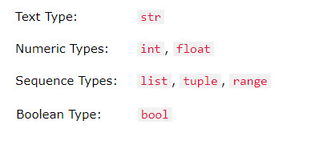

# Session 2: Python Data Types, Condition and double loops

## Session 2.1 Data Types String and Number

### 1 Use PostToChat to print a "String" to Minecraft

In Python any amount of text call a `string`, you could use string like this

```python
print("Hello Minecraft")

name ="Steve the Miner"

print(name)
```

#### - [Mission-2.1] Say Hello to other in the Minecraft

To say "Hello" to everybody in the Minecraft server, you could do below

```python
from mcpi_e.minecraft import Minecraft
serverAddress="server-address" # change to your minecraft server
playerName ="yourname"
pythonApiPort=4711

mc=Minecraft.create(serverAddress,pythonApiPort,playerName)
mc.postToChat("Hello!")

```

#### [Mission-2.2] Use Python Input Function input other's nae

You could take the data from input, try blow

```python
name=input("What's your name?")
mc.postToChat(playerName+" say: Hello, "+name+"!")
```

#### [Mission-2.3] Try the format function to build a string

Other than user "+" to connect string into a sentence, you could use format function:

```python
yourName ="stoneskin2020"
aname=input("Who you want say hello to?")
print("{} say: Hello {}!".format(yourName,aname))
```

### 2 Convert a String to Number with `int()`

String and Integer is different DataType, for detail please read [Python Data Types](https://www.w3schools.com/python/python_datatypes.asp).
Below is the Data Types we possible will used in our class



example of get type of a variable:

```python
x = 5
print(type(x))
```

The data you got form input is a string, we need convert to number before using as number. `int(str)` could do this job.

```python
blockType=input("Enter a block type:")
blockTypeId=int(blockType)

```

other way if you want change a int to string, you could use `str(number)`

```python
value=103
print("Watermelon block id is "+str(value))
```

#### [Mission-2.4] Create a block with input

```python
...
blockType= #add input() function here
blockTypeId= # add convert code here transfer string to int

x,y,z=pos=mc.player.getTilePos()

mc.setBlock(x,y,z,blokTypeId)

```

#### [Mission-2.5] Use `try: except:` to get the error

Python will throw the error to the terminal, you can get that error message and handle it.

```python
try:
    number=int(input("what's the block type you want get?"))
except:
    print("Invalid input: please enter a number!")
```

add upper code to your previous code, and try it.

#### [Mission-2.6] Use `Sleep` to wait some time

Some time you want wait some time and continue run your code, you could use `sleep`

```python
import time # this need use time module
time.sleep(30) #Make the program wait 30 seconds
```

Please finish below code to check how long you move

```python
import time
from mcpi_e.minecraft import Minecraft
serverAddress = "the server" # change to your Minecraft server
playerName = "your user name" # change to your username
pythonApiPort = 4711
mc = Minecraft.create(serverAddress,pythonApiPort,playerName)

pos1 = mc.player.getTilePos()

time.sleep(15) # change to the second you like to wait

pos2=mc.player.getTilePos()

#compare the distance
xDistance = pos1.x - pos2.x
yDistance = pos1.y - pos2.y
zDistance = pos1.z - pos2.z

print("x-distance="+xDistance+"  y-distance="+yDistance+" z-distance="+zDistance)
# Post the results to the chat
mc.postToChat("x-distance={}  y-distance={} z-distance={}".format(xDistance,yDistance,zDistance))
```

#### [Mission-2.7][Homework] Put them together

Write a python script do one or more of below:

1. use `for` loop run the code at least 5 times, use `time.sleep` in each loop for waiting some time before next loop.
2. In each loop, ask user input a block type between 0 to 250. ([blocktype id list](https://minecraft-ids.grahamedgecombe.com/), some id is not works)
3. if user give is not a valid number print "please give a valid blocktype" (use `try..except`)
4. get the user's current tile position, and place block
5. ask the user input how many blocks you want to stack, modify the code to build a stacks of blocks.
6. post to the chat for when the script running done.
7. [**challenge**] other than stack block, ask the user input what kind of building you want to build, ex, tower, wall, house etc
Send your code to the teacher by email (stoneskin@gmail.com)

#### [Videos of Session 2.1]

1. [python minecraft session 2.1 Development Environment](https://youtu.be/4pyjFvuFkR0)
2. [python minecraft session 2.1 introduce - Use Python And Idle](https://youtu.be/48J3qUlaU4E)
3. [python minecraft Session 2.1 mission 2.1](https://youtu.be/Kbx8ZKZXJS0)
4. [python minecraft session 2.1 mission 2.2](https://youtu.be/asKvk_84xDE)
5. [python minecraft session 2.1 mission 2.3](https://youtu.be/KKs365TBkqo)
6. [python minecraft session 2.1 mission 2.4](https://youtu.be/ngD-q4ZLVW4)
7. [python minecraft session 2.1 mission 2.5](https://youtu.be/S4dIDt-Qu84)
8. [python minecraft session 2.1 mission 2.6](https://youtu.be/kgDYlXp5tcg)
9. [python minecraft session 2.1 mission 2.7 homework](https://youtu.be/nh_oDq_Y0m8)
