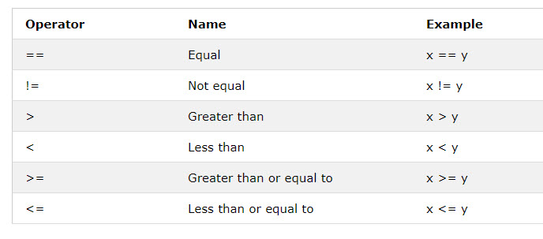
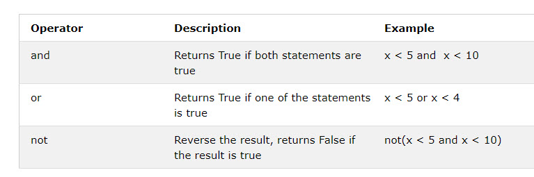
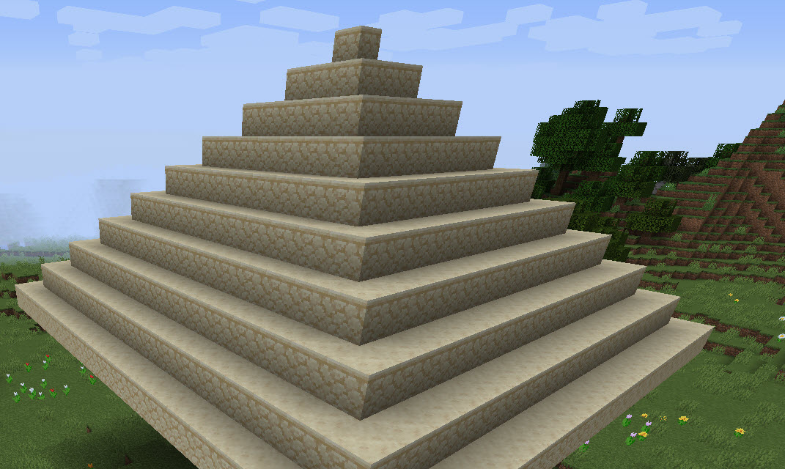

# Session 2: Python Data Types, Condition and double loops

## Session 2.2 Data Types Boolean Condition

### 1 Boolean and Condition Basic

Booleans represent one of two values: `True` or `False`

For learn more and practic Boolean, please check [Python Boolean](https://www.w3schools.com/python/python_booleans.asp)

#### - [Mission-2.8] Try Comparatoers in python

Python has below comparatoers


Try below python code and remember their result is `True` or `False`

```python
a=True
b=False

print("a=",a)
print("b=",b)
print("is a equals b",a==b)
print("is a  not equals b", a!=b)

x=2
y=3
print ("x={} y={}".format(x,y))
print("is x equals y",x==y)
print("is x greater than y", x>y)
print("ix x smaller than y", x<y)
```

#### - [Mission 2.9] use `if ... elif..else` with boolean to Check if you are in water or not

To learn Python Conditions please check [Python If...Else](https://www.w3schools.com/python/python_conditions.asp)
Try blow code in Minecraft

```python
from mcpi_e.minecraft import Minecraft
from mcpi_e import block

serverAddress = "localhost" # change to your minecraft server
playerName = "yourname"
pythonApiPort = 4711

mc = Minecraft.create(serverAddress,pythonApiPort,playerName)

pos = mc.player.getPos()
x = pos.x
y = pos.y
z = pos.z

blockTypeId=mc.getBlock(x,y,z)
if(blockTypeId==block.WATER.id):
    mc.postToChat("["+playerName+"]: I am swimming!")

```

update upper code using more conditions with `elif` and `else`

```python
...

blockTypeId=mc.getBlock(x,y,z)
if(blockTypeId==block.WATER.id):
    mc.postToChat("["+playerName+"]: I am swimming!")
elif(blockTypeId==block.AIR.id):
    mc.postToChat("["+playerName+"]: I am flying!")
else:
    mc.postToChat("[{}]: I am on block {}".format(playerName,blockTypeId))


```

#### - [Mission 2.10] Use Logical Operators `and` `or` `not`



Learn more could check [python logical operators](https://www.w3schools.com/python/trypython.asp?filename=demo_oper_logical3)

Try below code with `and` to validate if blockTypeId is valid or not.

```python
# example of and
if(blockTypeId <0 and blockTypeId >252):
    print("It's not a valid blockId")
```

below code use `or` to check if you are on the ground

```python
# example of or
if(blockTypeId ==block.DIRT.id or blockTypeId == block.GRASS.id):
    mc.postToChat("I am on the ground.")
```

below code user `not` to reverse True or False
`not(True) == False`
`not(False) == True`

```python
# example of not
if(not(blockTypeId ==block.WATER.id)):
    mc.postToChat("I am not in water.")
```

#### - [Mission 2.11] Check if you are in some area

Complete the code to check if you are in your home

```python
#step 1 get your home location and size
homeX=?
homeY=?
homeZ=?
homeWidth=10
homeHeight=5
homeLength=15

pos=mc.player.getTilePos()

insideX = homeX <pos.x < homeX+homeWidth
insideY = #todo
insideZ = # toto
if(inside):
    print("I am in my home")
else:
    print("I am out of my home")


```

### 2 While loop & Double loops

You could put one loop in another loop, it call double loop.

#### - [Mission 2.12] use loop build a wall

let's start build a tower with single loop

```python
from mcpi_e.minecraft import Minecraft
from mcpi_e import block

serverAddress = "localhost" # change to your minecraft server if different
playerName = "yourusername" # change to your name
pythonApiPort = 4711

mc = Minecraft.create(serverAddress,pythonApiPort,playerName)

pos = mc.player.getTilePos()
x = pos.x
y = pos.y
z = pos.z

#build a tower use loop
for h in range(5):
    print("h=",h)
    mc.setBlock(x,y+h,z,block.STONE.id)
```

you could build couple of tower to make it wall

```python
for h in range(5):
    print("h=",h)
    mc.setBlock(x,y+h,z,block.STONE.id)
    mc.setBlock(x+1,y+h,z,block.STONE.id)
    mc.setBlock(x+2,y+h,z,block.STONE.id)
    mc.setBlock(x+3,y+h,z,block.STONE.id)
    mc.setBlock(x+4,y+h,z,block.STONE.id)
```

#### - [Mission 2.13] Using double loop build a wall

Try To use double loop:

```python
for h in range(5):
    for w in range(5):
        print("h={} w={}".format(h,w))
        mc.setBlock(x+w,y+h,z,block.STONE.id)
```

#### - [Mission 2.14] Add condition to your code of build wall

you could put some pattern on your wall, add below code to your missiion 2.13 code

```python
... loop
    ...
       if(w==y):
            mc.setBlock(x+w,y+h,z,block.BEDROCK.id)

```

#### - [Mission-2.15] Build a 5x5x5 Cube

you need 3 layers of loop,  see below example of add 3 layer of loop on mission 2.3.

```python

id=103
for k in range(0,5):
   for j in range(0,5):
      for i in range(0,5):
         mc.setBlock(x+j,y+i,z+k,id)

```

#### - [Mission-2.16] Using double loop to explore the map

create a map, or use a map mods,
then try to use python code move your player to exploer the map
x from -1000 to 1000 step 75
z from -1000 to 1000 step 75
you need stay each place for 5 sec waiting for the view be loaded

```python
...
import time
...

for x in range(-1000,1000,75):
    mc.player.setTilePos(x,y,z)
    time.sleep(5) #waiting the world data lod
```

#### - [Mission-2.17] Using while loop

`while` loop is dangerous than `for` loop, because it possible never ending running.

Check more details about [while loop](https://www.w3schools.com/python/python_while_loops.asp)

Below is a simple while loop, i will increase 1 in each loop, when i=6, the `i<6` is `false`, the `while` loop will stop.

```python
i = 1
while i < 6:
  print(i)
  i += 1 # this make i increase, and when i <6 is false, the while loop will stop.
```

Below is a example of a infinity `while` loop, it will running until you close the shell window or press `ctrl + C` to stop it.

```python
from random import *
   flower = 38
   while True:
      x, y, z = mc.playerEn.getPos()
      blockId= mc.getBlock(x, y, z)
      print("current block:" + str(mc.getBlock(x, y, z)))
      if(blockId==0 or blockId ==78):
         mc.setBlock(x, y, z, flower,randrange(8))
      sleep(1) # wait 1 sec to continue
```

#### - [Challenge] [Mission-2.17] Build a pyramid in Minecraft

Modified your code in mission-2.15, build a pyramid.
please show you work by send your pyramid's location and your script to the teacher. stoneskin@gmail.com


