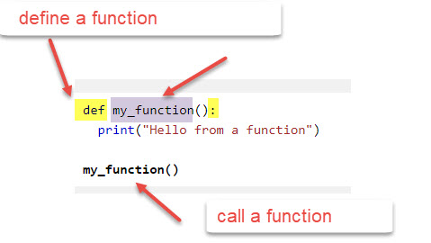
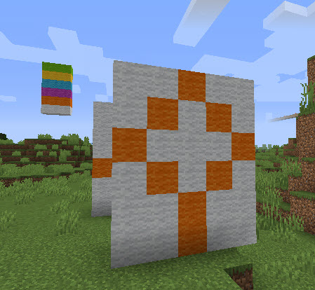
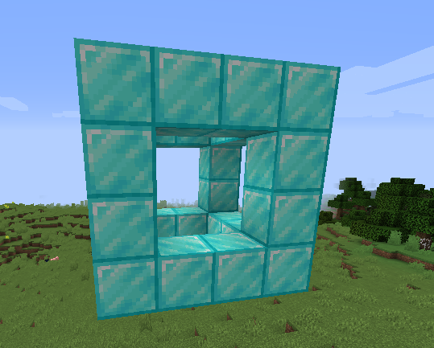

# Session 3: Python Function, Pixel Art and Minecraft Server

## Session 3.1 Python use functions & Make Pixel Art

### 1. Use function to organize your scripts

#### - [Mission-3.1] Define your first Python function

Below is example of a function, for more info, please check [python function](https://www.w3schools.com/python/python_functions.asp)


please try below function:

```python

from mcpi_e.minecraft import Minecraft
serverAddress="server-address" # change to your Minecraft server
playerName ="your name"
pythonApiPort=4711

mc=Minecraft.create(serverAddress,pythonApiPort,playerName)

#define a function
def SayHello():
    mc.postToChat("hello minecraft!")

# call the function
SayHello()
```

#### - [Mission-3.2] Define a Python function with arguments

Function could take parameters, for example, you could pass the name to the `SayHello` function:
the name call argument.

```python
def SayHello(name);
    mc.postToChat("*************************")
    mc.postToChat(" Hello "+name+"!")
    mc.postToChat("*************************")

SayHello("Smith")
```

And you could define a function to take more arguments,
and you could call another function in you function.

```python
import time

#define a function
def makeMelon(shiftX, shiftY, shiftZ):
    pos = mc.player.getPos()
    x = pos.x+shiftX
    y = pos.y+shiftY
    z = pos.z+shiftZ
    mc.setBlock(x, y, z, 103)
    time.sleep(10)

def makeMelonCross()
    #call your function by change the number little bit
    makeMelon(0, 1, 0)
    makeMelon(0, 2, 0)
    makeMelon(0, 3, 0)
    makeMelon(1, 3, 0)
    makeMelon(-1, 3, 0)
    makeMelon(2, 3, 0)
    makeMelon(-2, 3, 0)
    makeMelon(0, 4, 0)
    makeMelon(0, 5 ,0)

makeMelonCross()

```

#### [Mission-3.3] Refactor: Improve the function in Mission3.2

Many time we don't want hardcoded to 103 for melon only,
change the function to MakeBlock and MakeCrossWithBock,  so you could pass any blockId to function
`makeCrossWithBlock(blockId)`

please do this yourself

#### [Mission-3.4] return value in the function

many time we need function return values, for example you call getTilePos()

```python
pos = mc.player.getTilePos()
```

Below is a example of how to define a function return a result.

```python
def my_function(x):
  return 5 * x

result=my_function(3)
print(result)

print(my_function(5))

```

#### [Mission-3.5] Define function in a different file and import as package

Some time we defined a function, we want it could be reused in many different script.
for example, almost all your code will need get the Minecraft api object `mc`, let's put it in separate files cal mc.py

So we will save  below python code a file call `createmc.py`

```python
#save below code as createMc.py
from mcpi_e.minecraft import Minecraft

def createMc():
    serverAddress="server-address" # change to your minecraft server
    playerName ="yourname"
    pythonApiPort=4711

    mc=Minecraft.create(serverAddress,pythonApiPort,playerName)
    return mc  #return the result back to caller

```

Then create another python file example, testMc.py, save in same folder as createMc.py

```python
# another py file, same folder as createMc.py
from createmc import *

mc=createMc()

mc.postToChat("Your Minecraft api created!")

```

#### [homework][Mission-3.6] Please refactor your old code

1. Use function in the build house code.
2. Use the function in the getInput and build structure

#### [Challenge][Mission-3.7] What happen if two function call each other or call itself

It's call recursion, similar like while loop, it need a break point to avoid infinite loop.

```python

from createmc import *

mc=createMc()
pos = mc.player.getTilePos()
high=10
blockId=103

def BuildTower(count=0):
    if(count>high):
        return #this is very important, otherwise the code will never stop running.
    mc.setBlock(pos.x+1,pos.y+count,pos.z,blockId)
    BuildTower(count+1)

BuildTower()

```

Your Challenge,  write two functions, make them call each other. Make sure give a condition you code could stop.  Try it in your own computer.

if your script didn't stop, close the windows or use `Ctrl + C` force to close the window.

### 2. Lists and Pixel Art with blocks

#### 2.1  Using Lists

To learn Python List, please check [Python Lists](https://www.w3schools.com/python/python_lists.asp)

#### [Mission-3.5] Build a list of color and stack it

```python
...
rainbowList = [0,1,2,3,4,5]
x,y,z=pos=mc.player.getTilePos()
for color in rainbowList:
    mc.setBlock(x+1,y,z,35,color)
    y+=1  # this is same as y=y+1

```

#### [Mission-3.6] Build a empty list and add different blocksId to it

```python
...
x,y,z=pos=mc.player.getTilePos()

#Create a empty List
blocks =[]
#add 5 ids on the blocks
for i in range(5):
    blocks.append(i)

print(blocks)
#set block stack with loop
for id in blocks:
    mc.setBlock(x+1,y,z,id)
    y=y+11

#or you could use while loop
# or you could use while loop
i=0
while (i<len(blocks)):
    mc.setBlock(x+2,y+i,z,blocks[i])
    i=i+1


```

Please note in the while loop example, it use blocks[i] to get the blocks with index.
Also, you could see the range(5) will return a list of [0,1,2,3,4]

#### [Mission-3.7] Build a two dimension Rainbow List

How about each item in the list is a list?

```python

twoDimensionRainbowList  = [[0,0,0],
         [1,1,1],
         [2,2,2],
         [3,3,3],
         [4,4,4],
         [5,5,5]]

```

#### [Mission-3.8] Build a pixel arts

See below code you will build a wall with pixel arts,
Notice, we use reversed function to change the order of the array.

```python
#Create a double List with a pixel arts
pixelArtList  = [
         [0,0,1,0,0],
         [0,1,0,1,0],
         [1,0,0,0,1],
         [0,1,0,1,0],
         [0,0,1,0,0],
         [0,0,1,0,0]
         ]

x=x+1  #shift x by 1
for row in reversed(pixelArtList ): # we need reverse the list
    for color in row:
        mc.setBlock(x,y,z,35,color)
        z=z+1 #add 1 to z so it put next as a row
    z=pos.z #reset the z to starting z
    y+=1
```

example:


#### [homework][Mission-3.9] Build your own pixel arts

Please build a happy face or your own pixel arts you want to display.
[challenge] Could you find a why not use `reversed()` function to build your arts in right order?

#### [Mission-3.10] Build a wall by build a 2d lists with loops

Let's see how to use loop to build a two dimension list with random block

```python
import random

blockTypes[1,48,67,103,22]

blocks=[]
for row in range(10):
    blocks.append([])
    for col in range(10):
        blocks[row].append(random.choice(blockTypes))
print(blocks)

# todo, build the blocks in the minecraft

```

Please try to build the blocks you crate as a wall in Minecraft.
*hint: you could use same code in the example of 3.8. Also you could try to get the value in the 2D list by `blocks[1][0]`*


#### [challenge] [Mission-3.11] Could you build a 3D list, and place in Minecraft?

Since you learn 1D list and 2D list, please build the 3D list yourself.
and place it in minecraft,  You could use more Air or Glass in your 3D structure so we could see the inside.

```python
cube = [[[57, 57, 57, 57], [57, 0, 0, 57], [57, 0, 0, 57], [57, 57, 57, 57]],
        [[57, 0, 0, 57], [0, 0, 0, 0], [0, 0, 0, 0], [57, 0, 0, 57]],
        [[57, 0, 0, 57], [0, 0, 0, 0], [0, 0, 0, 0], [57, 0, 0, 57]],
        [[57, 57, 57, 57], [57, 0, 0, 57], [57, 0, 0, 57], [57, 57, 57, 57]]]
startingX = x
startingY = y

#todo, try use triple loop to build the cube

```

The cube will looks like below


Thanks about any building could be save as a 3d list in minecraft