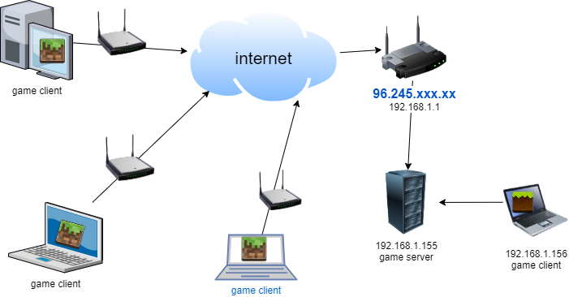
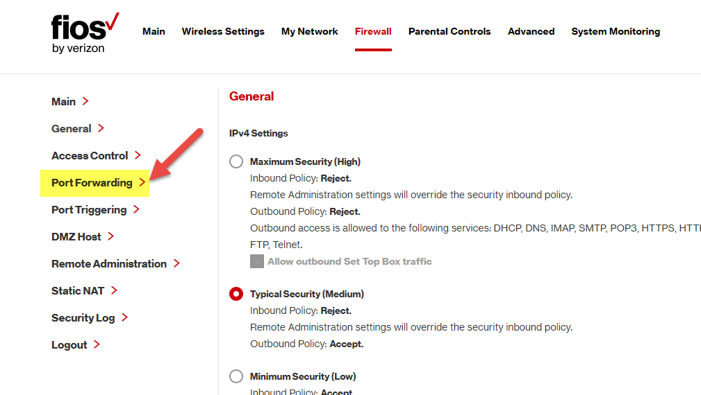
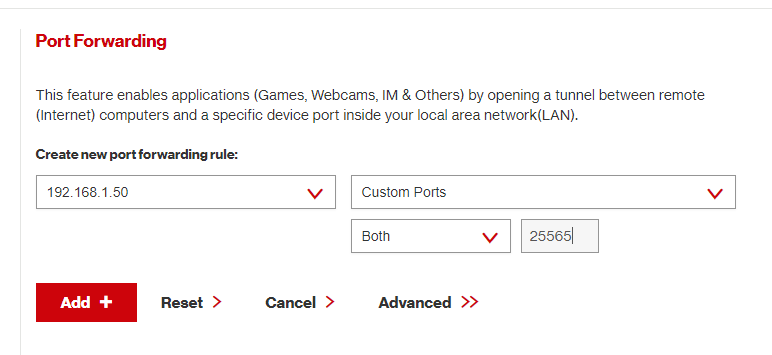
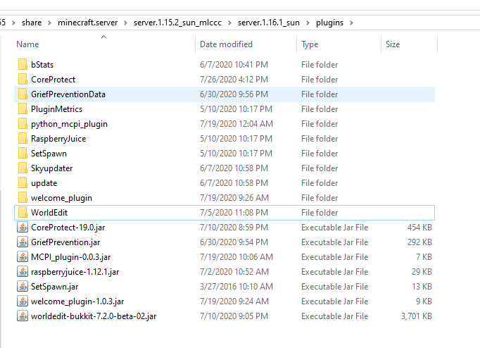

# Session 3: Python Function, Pixel Art and Minecraft Server

## Session 3.2 Minecraft Server network concept

### Network, Router, firewall and ports

#### 1. How Minecraft works in Network

Below diagram show how your pc and and the game server in the network.



##### 1.1 Minecraft client and server

- Minecraft game client is running in the laptop or desktop computer.
- There is one computer will has minecraft server running.
- The Minecraft server and game client could running in same computer.
- The laptops or desktop computer connect to internet through a router.

##### 1.2  Router (Modem Router)

- Modem is the device that connect to your internet service supplier (ISP)
- Router is the device that distribute data to your computers.
- It could be a modem router connect your internet and private network
- Or it could be two device one modem connect internet one router.

##### 1.3 Private and public network

- The the computers behind the routers make a private network.
- The internet connect to all other computer call public network

##### 1.4 IP Addresses

- Each router/modem connect to internet will have a public IP address come from your ISP
- The Router is the gateway of your private network, it also have a internal IP address.
- Usually the router's internal IP address is 192.168.0.1 or 192.168.1.1
- Each computer has a IP address, usually the computer's IP address is assigned by router
- the computer's IP address last digital could be range of 2 -255
  


##### 1.5 [homework] Find why the the ip address biggest value is 255

- [hint](https://www.howtogeek.com/wp-content/uploads/2018/01/image-1-2.png)

------

#### 2. Router settings, port and firewall

##### 2.1 View the Router settings

if you visit your router by the address 192.168.0.1 or 192.168.1.1 (base on your router default setting). You will be asking the password, if you have password, you could get in and see some page like below.


- The WAN is the external network, you it connect to another router from your ISP.
- And all the computer connect to your home network will be list on the router.

##### 2.2 The ports

In computer networking, a [port](https://en.wikipedia.org/wiki/Port_(computer_networking)) is a communication endpoint.
 if a software application or service needs to communicate with others, it will expose a port. Ports are identified with positive 16-bit unsigned integers, ranging from 0 to 65535.

**Common network ports number**

| Port Number | Usage |
| ------------| ----------- |
| 20 | File Transfer Protocol (FTP) Data Transfer |
| 21 | File Transfer Protocol (FTP) Command Control |
| 22 | Secure Shell (SSH) |
| 23 | Telnet - Remote login service, unencrypted text messages|
| 25 | Simple Mail Transfer Protocol (SMTP) E-mail Routing |
| 53 | Domain Name System (DNS) service |
| 80 | Hypertext Transfer Protocol (HTTP) used in World Wide Web|
| 443 | HTTP Secure (HTTPS) HTTP over TLS/SSL |

As you already know, Minecraft client software communicate with the server through the port number "25565", and you could change that if you host multiple Minecraft servers in one computer.


##### 2.3 Network Firewall

Network [Firewall](https://en.wikipedia.org/wiki/Firewall_(computing)) is a network security system that monitors and controls incoming and outgoing network traffic based on predetermined security rules.
Most of your router has build in firewall in the hardware, it add a layer of security between your home network and the internet.


So by default, if you host a minecraft server on your home computer. You friends couldn't access it because the firewall on your router didn't allow other computer to connect through the port not open.
You could go to the router -> firewall setting and open the port forwarding for it. ( [more minecraft port forward](https://www.wikihow.com/Portforward-Minecraft))



Simply you just need let router forward the request to port 25565 to the computer address where your Minecraft server is on.  There are two type of protocols could use the port for different type of data, minecraft need support both TCP/IP(Transmission control Protocol/Internet Protocol) and UDP (User Datagram protocol), so for verizon 'Fios' router, I choice both in the dropdown.

If you also want other player run the python on the server,  you could add the RaspberryJuice plugin default port 4711 (TCP/IP) on the firewall porting forwarding.


------

#### 3 Minecraft Servers Mods and Plugin

The different of Mods and Plugin is tha Plugin only install on the Minecraft server, but Mods must be install on client.

- Official villain Server did not support Plugin.
- Forge server support Mods installed on the server Mods folder.  And only client with same mods could connect to it and use it.
- Bukkit and spigot Server support plugin, any client connect to the server could use the plugin with Minecraft command.

#### 3.1 Minecraft Plugins used in our server

Our server had installed 7 plugins.


We could get bukkit/spigot plugin from the [curseforge bukkit plugin](https://www.curseforge.com/minecraft/bukkit-plugins) or [spigot resource site](https://www.spigotmc.org/resources/categories/spigot.4/)

- [CoreProtect](https://www.curseforge.com/minecraft/bukkit-plugins/coreprotect) With the plugin, you could check who did what, and could roll back and restore the change.
- [Grief Prevention](https://www.curseforge.com/minecraft/bukkit-plugins/grief-prevention) You could claim the lot and build on it, so other couldn't damage it.
- [WorldEdit](https://www.curseforge.com/minecraft/bukkit-plugins/worldedit) You could copy, edit, save your building.
- [SetSpawn](https://www.curseforge.com/minecraft/bukkit-plugins/setspawn) There are many of SetSpawn plugin, this come with spigot.
- [RaspberryJuice](https://www.curseforge.com/minecraft/bukkit-plugins/raspberryjuice) The plugin that allow you could call Minecraft Pi Api, which we used for Python programming in our class.
- [welcome_plugin](https://www.curseforge.com/minecraft/bukkit-plugins/welcome-message-plugin) The plugin I wrote for our class server, It support line break and multiple section on the welcome page. The source code could be found in my [github](https://github.com/stoneskin/mc_stoneskin_welcomeplugin)
- [MCPI_plugin](https://www.spigotmc.org/resources/python-plugin-for-mcpi.81664/) The plugin I wrote for call the python script from the Minecraft command. The source code is [here](https://github.com/stoneskin/minecraft_python_mcpi_plugin/).

#### 3.2 How to write python code for MCPI plugin and running on server

In our previous example when we ru a python code,  the command is like

```python
py c:\python\test.py
```

And you could pass one or more arguments

```python
py c:\python\test.py myName
```

But in you python code, you need code to received the arguments pass through outside.

```python
import sys

name="n/a"
value=0

#get first arguments
if len(sys.argv)-1>0:
    ame=sys.argv[1]
print("name="+name)

#get 2nd arguments
if len(sys.argv)-1>1:
    try:
        value=int(sys.argv[2])
    except:
        print("2nd argument is not a number")
```

For MCPI plugin,  the first argument is always the `playId`, below is the example of python code could call by MCPI plugin


```python
################################################
# pyramid.py
# call from minecraft /py pyramid 5
###############################################
from mcpi_e.minecraft import Minecraft
from mcpi_e import block
import sys

#--------------------------------------------------------
# default value for connect minecraft
serverAddress = "127.0.0.1"
playerName = "default name"
pythonApiPort = 4711

#------------------------------------------------------
# default value for create pyramid
blockId=block.SANDSTONE.id #default
size=5

# code of get value from arguments
if len(sys.argv)-1>0:
    playerName=sys.argv[1]
if len(sys.argv)-1>1:
    try:
        size=int(sys.argv[2])
    except:
        print("1nd argument is not a number, will use default size=5")
if len(sys.argv)-1>2:
    try:
        blockId=int(sys.argv[3])
    except:
        print("2nd argument is not a number, will use default blockId= Sand")

#------------------------------------------------------
# code of build a pyramid
mc = Minecraft.create(serverAddress,pythonApiPort,playerName)

pos = mc.player.getPos()
x = pos.x
y = pos.y
z = pos.z

for i in range(0,size):
    for j in range(i,size-i):
        for k in range(i,size-i):
            mc.setBlock(x+j,y+i,z+k,blockId)

```

##### 3.3 [homework]  write a python code you could used in game.

1. Install MCPI plugin to your local server
2. Test the pyramid code in your local server
3. Write your own code to implement function want used in minecraft.
4. **[Challenge]** Write multiple functions in your code, and pass the args from minecraft to choice which function be called.

