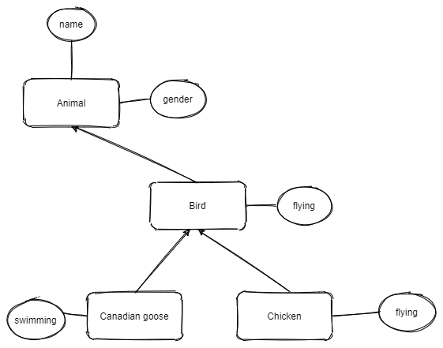
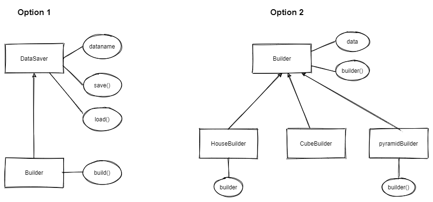

# Session 4: Python File , Module, Class  and Using Github

## Session 4.1 Python Files and Class

### 1 The file  system  in Python

#### [Mission 4.1] The file path

First we need to know where is the file will be load and save to.

Bellow code will get the path current code is running.

```python
import os
path = os.getcwd()
print(path)
```

#### [Mission 4.2] Saving and Loading file with Python

Write the string to the default path

```python
myFile=open("Data.txt","w")
myFile.writelines("test string")
myFile.close()

```

the 2nd arguments of the `open` command is "w", which is mean writing permission.

| Mode | Description |
| -------- | -------- |
| 'r' | Open a file for reading. (default) |
| 'w' | Open a file for writing. Creates a new file if it does not exist or truncates the file if it exists. |
| 'x' | Open a file for exclusive creation. If the file already exists, the operation fails. |
| 'a' | Open for appending at the end of the file without truncating it. Creates a new file if it does not exist. |
| 't' | Open in text mode. (default)|
| 'b' | Open in binary mode. |
| '+' | Open a file for updating (reading and writing)|

Below example will show how to open a file given a file path,
Also you `\` is escape character,  `\\` make sure the program read the `\`, because `\t` mean add a tab, and `\r` is line break.

```python
myFile1=open("C:\\Python\\Data.txt","w")
myFile1.writelines("test line1")
myFile1.writelines("\tcontinue on line1")
myFile1.writelines("\ntest line2")  # add a line break \n
myFile1.close()

myFile2=open("C:\\Python\\Data.txt","r")
print("line1:"+myFile2.readline()) #read first line
print("line2:"+myFile2.readline()) #it will auto ready next line

myFile2.close()

```

### 2 Dumping and Loading set of data to Files with `Pickle` Module

#### [Mission 4.3] Save a list to file with `Pickle`

Pickle is a module to help to hand save and load files, especially when you have a bunch of data need to save.
 
For using Pickle, you need use `b` model to save data in binary.

```python
import pickle
list=[1,2,3,4,5]
myFile=open("testData.txt","wb")
pickle.dump(list,myFile)
```
import pickle

```python
myFile=open("testData.txt","rb")
list= pickle.load(myFile)
print(list)
```

please run it and check the file.

#### [Mission 4.3] the different of `from import` and `import` the module

In the previous example  we use `import pickle`,  and when you use the pickle module, you need call with the module name. ex

```python
import pickle
...
pickle.dump(list1,myFile)
...
list2=pickle.load(myFile)
```

if you only need use some function of the pickle, you could just `from ... import` to import the function you need.
In this case, you will needn't pass the module name.

```python
from pickle import dump  # only dump be import
...
dump(list1,myFile)
```

also you could import all functions with wildcat `*`

```python
from pickle import *
...
dump(list1,myFile)
...
list2=load(myFile)
```

Change your code and run to see the different.

#### [homework] [Mission 4.4] Refactor you code of you pixel arts

 For your home work in the last session, please refactor the code, and save the list  to file with pickle.  
 also the cube could be saved as as file name `cube.txt` too.

#### [Mission 4.5] Save a building structure to a list and dump to a file

Let's see the below code example to read the current structure in your game, and save it as file.

```python
from mcpi_e.minecraft import Minecraft
from mcpi_e import block

import pickle

serverAddress="192.168.1.155" # change to your minecraft server
playerName ="stoneskin2020"
pythonApiPort=4711

mc=Minecraft.create(serverAddress,pythonApiPort,playerName) 

#this function make sure the smaller number as value1
def sortPair(v1,v2):
    if v1>v2:
        return v2,v1
    else:
        return v1,v2

# this function will get the value of blockId in the input location and save as 3d list
def copyStructure(x1,y1,z1,x2,y2,z2):
    x1,x2 = sortPair(x1,x2)
    y1,y2 = sortPair(y1,y2)
    z1,z2 = sortPair(z1,z2)

    structure=[]
    print ("starting build the data structure...")
    for x in range(x1,x2):
        listX=[]
        structure.append(listX)
        for y in range(y1,y2):
            listY=[]
            listX.append(listY)
            for z in range(z1,z2):
                #print("x:{},y:{},z:{}".format(x,y,z))
                blockId=mc.getBlock(x,y,z)
                listY.append(blockId)
            print(listY)
    return structure

print("This python code will save the minecraft structure to the file")
input("Move to the first position, and press Enter:")
(x1,y1,z1)=pos1=mc.player.getTilePos()
input("Move to the second position, and press Enter:")
(x2,y2,z2)=pos2=mc.player.getTilePos()

data=copyStructure(x1,y1,z1,x2,y2,z2)
print(data)
filename=input("Please give a file name you want to save:")
if(filename==""):
    filename="test_tata"
filename=filename+".txt"
print("will save as "+filename)

theFile=open(filename,"wb")
pickle.dump(data,theFile)

```

**[Home work]** Please run the code save a structure as file, and write a code to load the file and rebuild the structure.

### 3 Object-oriented Basic

Object Oriented programming (OOP) is a method of structuring a program by bundling related properties and behaviors into individual objects.

Think about your code is a farm or factory,  there is buildings, farmers, animals, workers ( builders, helpers etc). And your programming output is the products. All are objects and each objects will have it's own properties, behaviors.

The Class is the template to create instance of objects. In python, it's a module that could have a group of variable and functions.

OOP has four major principles, if want lear more please [read this](https://medium.com/@cancerian0684/what-are-four-basic-principles-of-object-oriented-programming-645af8b43727) or
[how to  explain object-oriented programming concepts to a 6 tear old](https://www.freecodecamp.org/news/object-oriented-programming-concepts-21bb035f7260/)


#### [Mission 4.6] Create your first Class and Object

For learning python [Class and Object](https://www.w3schools.com/python/python_classes.asp), please [read more](https://www.w3schools.com/python/python_classes.asp).

**The name convention of the Class is it's name should start with Upper case**

Define  a class:

```python
# this is a empty class
class Test():
    pass
```

Define a class "Cat":

```python
class Cat(object):
    def __init__(self,name,weight):
        self.name = name
        self.weight = weight
```

The Class has a special function `__init__` it call contractor.  it response to init the class. see below example of create a instance of the Cat class.

To make two new Cats object and add it to list

```python
aKitten=Cat("kitty",2)
aCat = Cat("fluff",4)

# a instance could be added to list
cats=[]
cats.append(aKitten)
cats.append(aCat)

```

*Note: you can't use pickle to dump a class directly, you have to serialize it to string before save to file, [read more](https://docs.python.org/3/library/pickle.html) if you interesting.*

#### [Mission 4.7] Accessing Attributes of a class

You can access the attributes of an object.

```python
theCat = Cat("theCat",4.5)
print("the Cat's name is '{}', and weight is {} ".format(theCat.name,theCat.weight))
```

#### [Mission 4.8] Add methods to Class

The Class could have multiple methods beside the constructor `__init__`

```python
class Dog:
    species = "Canis familiaris"

    def __init__(self, name, age):
        self.name = name
        self.age = age

    # Instance method
    def description(self):
        return f"{self.name} is {self.age} years old"

    # Another instance method
    def speak(self, sound):
        return f"{self.name} says {sound}"
```

To use the methods defined in class

```python
wang = Dog("a-wang",4)

print(wang.speak("woof woof"))

print(wang)

```

you will see if you print a instance of your class, it's give result like

```python
__main__.Dog object at 0x00aeff70>
```

There is special function to make it return the right format:

```python
class Dog:
    # Leave other parts of Dog class as-is

    # Replace .description() with __str__()
    def __str__(self):
        return f"{self.name} is {self.age} years old"
```

please try it in your code.

#### [Mission 4.9] Understand Inheritance of python

Inheritance is the process by which one class takes on the attributes and methods of another. Newly formed classes are called child classes, and the classes that child classes are derived from are called parent classes.

See the example of Animal classes with parent and child relationship:


``` python
class Animal:
    def __init__(self,name,gender):
        self.name=name
        self.gender=gender
    def __str__(self) -> str:
        return "class={}: name:{} gender:{}".format(type(self).__name__,self.name,self.gender)

class Bird(Animal):
    def __init__(self,name,gender):
        Animal.__init__(self,name,gender)
    def flying(self):
        return "birds flying..."  

class Chicken(Bird):
    def __init__(self,name,gender):
        super().__init__(name,gender) #python 3 and upper you could use supper() to init parent without self
        self.gender=gender
    def flying(self):
        return "chicken {} can't fly..".format(self.name)

class CanadianGoose(Bird):
    def __init__(self,name,gender):
        Bird.__init__(self,name,gender)
    def swimming(self):
        return "Canadian Goose floating on the water.."

aHen = Chicken("egg hatcher","F")
aRooster = Chicken("big Foot","M")
aGoose = CanadianGoose("wild goose","unknown") 

print(aHen.flying())
print(aGoose.flying())
print(aGoose.swimming())
print(aRooster)
```

#### [Challenge] [mission 4.10] Rewrite your homeworks with Object Oriented style

1. group your functions as methods of a Classes
2. make a child class that has all methods of parents class, but has one or two new methods or same methods do different than parents
3. please send your home work to stoneskin@gmail.com

[hint: you could check the below two options]
