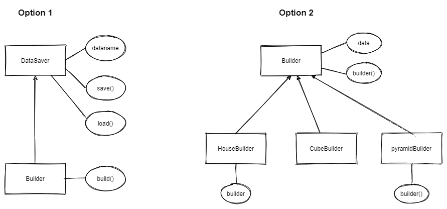
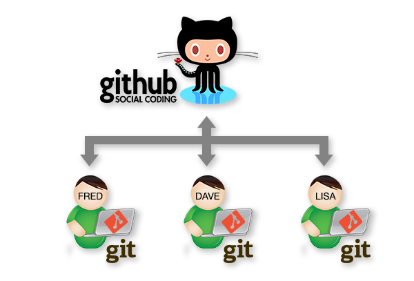
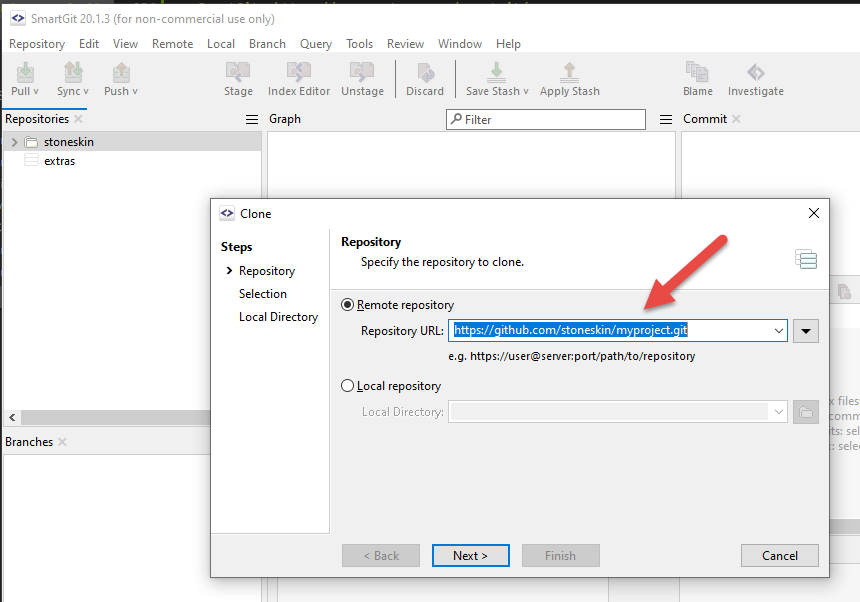

# Session 4: Python File , Module, Class  and Introduce Github

## Session 4.2 Python Object-Oriented Programming and Introduce github

### 1. OOP in Python 

#### [Mission 4.9] Understand Inheritance of python

Inheritance is the process by which one class takes on the attributes and methods of another. Newly formed classes are called child classes, and the classes that child classes are derived from are called parent classes.

See the example of Animals classes and their parent-child relationship:


Animal is the Top level class , and it has B

``` python
class Animal:
    def __init__(self,name,gender):
        self.name=name
        self.gender=gender
    def __str__(self) -> str:
        return "class={}: name:{} gender:{}".format(type(self).__name__,self.name,self.gender)

class Bird(Animal):
    def __init__(self,name,gender):
        Animal.__init__(self,name,gender)
    def flying(self):
        return "birds flying..."  

class Chicken(Bird):
    def __init__(self,name,gender):
        super().__init__(name,gender) #python 3 and upper you could use supper() to init parent without self
        self.gender=gender
    def flying(self):
        return "chicken {} can't fly..".format(self.name)

class CanadianGoose(Bird):
    def __init__(self,name,gender):
        Bird.__init__(self,name,gender)
    def swimming(self):
        return "Canadian Goose floating on the water.."

aHen = Chicken("egg hatcher","F")
aRooster = Chicken("big Foot","M")
aGoose = CanadianGoose("wild goose","unknown") 

print(aHen.flying())
print(aGoose.flying())
print(aGoose.swimming())
print(aRooster)
```

#### [Challenge] [mission 4.10] Rewrite your homeworks with Object Oriented style

1. group your functions as methods of a Classes
2. make a child class that has all methods of parents class, but has one or two new methods or same methods do different than parents
3. please send your home work to stoneskin@gmail.com

[hint: you could check the below two options]


#### [mission 4.11] Build a tree and forest in Minecraft

##### Example of the tree

```python
import math
from mcpi_e import block
from mcpi_e.vec3 import Vec3
import random
import time

class Tree:
    desc="Tree"
    woodId=17
    leavesId=18
    pos = Vec3(0,0,0)
    high=6

    def __init__(self,position,typeid=0):
        self.typeId=typeid
        self.pos=position

    def buildTree(self,mc):
        self.__buildTrunk(mc)
        self.__buildLeaves(mc)
    def __buildTrunk(self,mc):
        for h in range(self.high):
            mc.setBlock(self.pos.x,self.pos.y+h,self.pos.z,self.woodId,self.typeId )
    def __buildLeaves(self,mc):
        treeSize=3
        for i in range(0-treeSize,treeSize+1):
            for j in range(0-treeSize,treeSize+1):
                 mc.setBlock(self.pos.x+i,self.pos.y+self.high,self.pos.z+j,self.woodId,self.typeId )
                 mc.setBlock(self.pos.x+i,self.pos.y+self.high+1,self.pos.z+j,self.leavesId,self.typeId )  
        for i in range(0-treeSize+1,treeSize-1):
            for j in range(0-treeSize+1,treeSize-1):
                mc.setBlock(self.pos.x+i,self.pos.y+self.high+2,self.pos.z+j,self.leavesId,self.typeId )
        for i in range(0-treeSize,treeSize+1):
            for j in range(0-treeSize,treeSize+1):
                if(abs(i)>1 or abs(j)>1 or abs(i)==abs(j)):
                    mc.setBlock(self.pos.x+i,self.pos.y+self.high,self.pos.z+j,self.leavesId,self.typeId)

```

##### Build some child Tree Class

```python
class BirchTree(Tree):
    def __init__(self,pos):
        self.desc="SpruceTree"
        super().__init__(pos,2) # spruce:1, birch:2, jungle:3

class BirchTree(Tree):
    def __init__(self,pos):
        self.desc="SpruceTree"
        super().__init__(pos,2) # spruce:1, birch:2, jungle:3


```

##### The code of test Tree inheritance

```python
from mcpi_e.minecraft import Minecraft
from mcpi_e import block
from mcpi_e.vec3 import Vec3
import random

import time
from tree import *

serverAddress = "127.0.0.1"
playerName = "youracct"
pythonApiPort = 4711

mc=Minecraft.create(serverAddress,pythonApiPort,playerName)
#mc.settings.SHOW_DEBUG=True
pos=mc.player.getTilePos()
aTree=Tree(pos)
aTree.buildTree(mc)

#build a Birch tree
x=random.randint(-15, 15)
z=random.randint(-15, 15)
pos2=Vec3(pos.x+x,pos.y,pos.z+z)
anotherTree= BirchTree(pos2)
anotherTree.buildTree(mc)
```

##### Example of build a RandomTree

```python
class RandomTree(Tree):
    treeList=[0,1,2,3] #oak:0, spruce:1, birch:2, jungle:3
    def __init__(self,pos):
        typeId= random.choice(self.treeList)
        self.desc="Random Tree type "+str(typeId)
        super().__init__(pos,typeId)
```

The code to test the tree

``` python
aRandomTree=RandomTree(pos2)
print(aRandomTree.desc)
aRandomTree.buildTree(mc)

```

##### Example of overload the parent method

```python

#a tree will disappear after 10s
class GhostTree(RandomTree):
    def __init__(self,pos):
        super().__init__(pos)
    def clear(self,mc):
        mc.setBlocks(self.pos.x-3,self.pos.y,self.pos.z-3,self.pos.x+3,self.pos.y+self.high,self.pos.z+3,0)
    def buildTree(self,mc): #override the parent method
        super().buildTree(mc)
        time.sleep(10)
        self.clear(mc)

```

### 2 Learn and using Github for your code Version Control

#### 2.1  What is version control

Version control system are software tools that help ou manage change of source code over time


#### 2.2 As a programmer, Why I need the Version Control System

- I want to keep entire code and change history. Just like save my game progress in each checkpoint.
- I want to view my code change history, and want to start from a previous check point.
- I want to get my code and continue working on it from another computer.
- I want my teammate can access the code and contribute from their computers too.
- I want my friends join my team and with together, but I don't want they overwrite my saved progress.

#### 2.3 What are Git and GitHub

- Git is a VCS(Version Control System) help you have version control for your code
- Git is the most popular VCS in the world.
- Git is powerful and easy to use.
- GitHub is a website and service the keep your source code , so you can access from any computer and share with your team.



#### 2.4 How Git and GitHub works

- You can create a local repository for your project by Git
- You can staging your code change before commit to local repository
- You can push to or fetch from the remote repository


#### 2.5 Download and install git

- Download git from https://git-scm.com/
- Client to install,  Click next and all use default settings


#### 2.6 Create a github account

- Go to  https://github.com/ and create a account.  


#### 2.7 Download and install a git GUI

- list of git client : https://git-scm.com/downloads/guis/
- SmartGit: https://www.syntevo.com/smartgit/
- VSCode git support

#### 2.8 Git command line

Use GUI client will save you time to remember those command line, but below is some git command line you can use when gui not available:
- https://dzone.com/articles/top-20-git-commands-with-examples
- https://education.github.com/git-cheat-sheet-education.pdf
- Examples
    - Show you current user name
		`Git config user.name`  
    - Change you current user name
        `git config user.name "myname"`

### 3 Use github to for your code and project

#### 3.1 Create your repository on the github

- login your github, you will see the create new repository button
    - 
- fill in the form of new repository, and click 'create repository'
    - 

#### 3.2 Clone the repository to you local computer

- check you repository, you could click the code button, and the url of the repository will be display like highlighted
  - 
- open SmartGit you installed early
  - 
- Paste your project repository url to the smart-git clone form
  -  
- click next, and chose the path of where you save your project
  - 
- you new repository be add to you local computer
  - 

#### 3.3 Add code to your local repository folder
- you could check you local src folder, and there will be a hiddle folder ".get" and a "README.md" file
  - 
- create or copy your project file to the repository folder
  - 
- check the smartGit and find your file
  -   - 
  
#### 3.4 Stage and check in your code to local repository

- Stage: select the files you want to save to repository
  - 
- Commit: checkin the statged files to git repository
  - 
  - 

#### 3.5 push your change to the github
- Push and Pull
  - push is upload you local repository change to the remote github server
  - Pull is get the latest change from remote github server to you local. It useful when multiple developer works on same source code, or you work the same code in different computer etc.
  - 
  - 
  - 
  - or you can use command line to push to the remote
    - 
  
#### 3.6 View your code on th github

After code be pushed, you can go to the github website to see your new code is be changed on the online github repository


### 4 Use Markdown and Github site to build your own website

####  4.1 understand the markdown file

you will see we add a README.md in our project


for how to use markdown, please check the [Markdown Cheat Sheet](https://www.markdownguide.org/cheat-sheet/)


for how to use github site to build your website check [here](https://onedrive.live.com/?authkey=%21ABw%2DLzmG9zyRWFA&cid=61E2F373B0D0BEF9&id=61E2F373B0D0BEF9%2151777&parId=61E2F373B0D0BEF9%2151750&o=OneUp)
