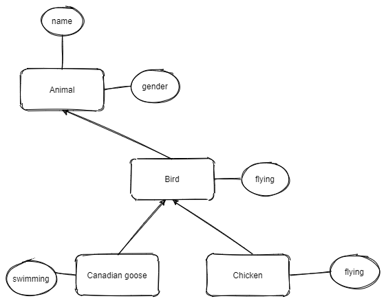

# Session 4: Python File , Module, Class  and Introduce Github

## Session 4.2 Python Object-Oriented Programming and Introduce github

### 1. OOP in Minecraft

#### [Mission 4.9] Understand Inheritance of python

Inheritance is the process by which one class takes on the attributes and methods of another. Newly formed classes are called child classes, and the classes that child classes are derived from are called parent classes.

See the example of Animal classes with parent and child relationship:


``` python
class Animal:
    def __init__(self,name,gender):
        self.name=name
        self.gender=gender
    def __str__(self) -> str:
        return "class={}: name:{} gender:{}".format(type(self).__name__,self.name,self.gender)

class Bird(Animal):
    def __init__(self,name,gender):
        Animal.__init__(self,name,gender)
    def flying(self):
        return "birds flying..."  

class Chicken(Bird):
    def __init__(self,name,gender):
        super().__init__(name,gender) #python 3 and upper you could use supper() to init parent without self
        self.gender=gender
    def flying(self):
        return "chicken {} can't fly..".format(self.name)

class CanadianGoose(Bird):
    def __init__(self,name,gender):
        Bird.__init__(self,name,gender)
    def swimming(self):
        return "Canadian Goose floating on the water.."

aHen = Chicken("egg hatcher","F")
aRooster = Chicken("big Foot","M")
aGoose = CanadianGoose("wild goose","unknown") 

print(aHen.flying())
print(aGoose.flying())
print(aGoose.swimming())
print(aRooster)
```

#### [Challenge] [mission 4.10] Rewrite your homeworks with Object Oriented style

1. group your functions as methods of a Classes
2. make a child class that has all methods of parents class, but has one or two new methods or same methods do different than parents
3. please send your home work to stoneskin@gmail.com

[hint: you could check the below two options]


#### [mission 4.11] Build a tree and forest in Minecraft
