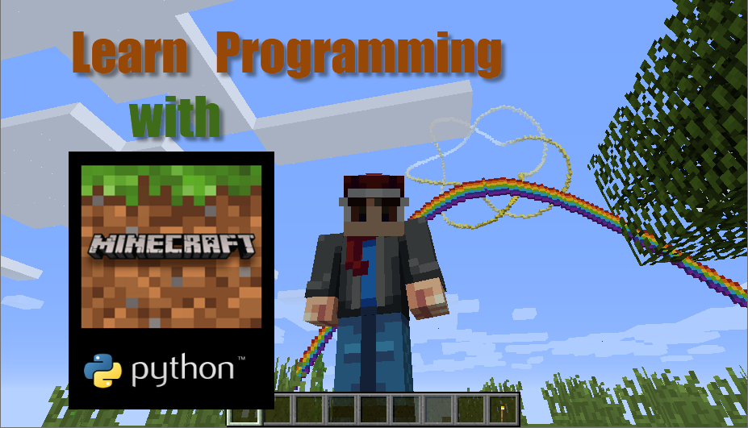

# Grade 6-8 Minecraft and Python Programming

## Description

Students will learn programming by writing Python code that runs within the Minecraft Game. Class content will include basic Python programming knowledge and network knowledge. Students will set up their own Minecraft Server, install modules, then write Python code to run in the Minecraft world. Our goal is to learn programming while having fun in Minecraft.

### MLCCC Classsroom Zoom Meeting rules

* Change your zoom user name to the real name same as you register the MLCCC classes.
* Keep your mic mute untill The teacher or TA asking you to talk.

### MLCCC Minecraft server rules

* Send your Minecraft username to the teacher otherwise you may be not in the whitelist.
* Respect other and help each other. No bully is allowed.
* Follow the intstruction of Teacher and TAs
* Do Not Try to attach the server. For complecate python script, please test on you own machine first.
* Do Not Damage other students building
* Do Not take items from others chaster or home(It's Ok from Villagers/NPCs) .

## Session 1: [6/19,6/26] Get started with Python and Minecraft

1. [Python and Minecraft installation](./Session1.1.md)
    * Demo what python could do in Minecraft game
    * Setup Minecraft server
    * Install Python and Modules
    * Run your first python code in the Minecraft world

2. Learn Programming with Python and Minecraft
    * Understanding the coordinates of Minecraft
    * Stack Blocks with loop

## Session 2: [7/10,7/17] Python Data Types, Condition and double loops

1. Data Types String and Number
   * Use PostToChat post String to Minecraft chat
   * Get a Number from input
  
2. Codition & loops
   * Are you in air or in water
   * Find the Ore with loop and condition
   * Build a wall or building with double or triple loop

## Session 3: [7/24,7/31] Minecraft server, Python Pixel Art

1. Minecraft server network concept
    * Network, firewall and port
    * Share your own minecraft server with you friends

2. Python use functions & Make Pixel Art
   * Use function to orgnize your scripts
   * Pixel Art with blocks

## Session 4: [8/7,8/14] Github , Module and Class

1. Github
   * create a github account
   * upload your python code to your repository
   * setup your site
2. Build a Tree and forest with Class
   * Tree Class with methods and attributes
   * Different Tree Using Inheritance
   * Build a forest with Class
  