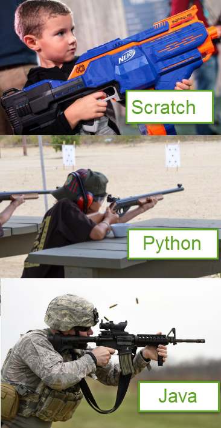

# Session 1.1 Get Start With Python

## 1.1 what is coding

- Computer programming, or coding is writing script using the language that computer can understand. 
- Coding is fun.
  - You can give order to computer
  - You can build a game
- Coding is using Computer to solve problems.
- Coding is a crucial skill every kids should learn.
- Coding is a valuable job skill for your future

## 1.2 What is  Python

- Python is real programming language
  - Compare to Scratch
- Python is Easy to Understand
  - Read like English
- Python is the most popular and growing language
  - [google trends](https://trends.google.com/trends/explore?q=python,Java,c%23,%2Fm%2F02p97,%2Fm%2F0jgqg&hl=en-US)
  - [stack overflow growth rate](https://149351115.v2.pressablecdn.com/wp-content/uploads/2017/09/growth_major_languages-1-1024x878.png)
  - [github language popularity](https://www.benfrederickson.com/images/github/language-popularity/major.svg)
- Python is best for beginner and for people who is not professional programmer to do coding.
  - Python is good for small project
  - Python is weak type language compare to C++, C# or Java



## 1.3  Install Python

- Go to <a target="_blank" href="https://www.python.org/downloads/">Python download page</a>, download and install **Python 3.8** and up
- <a href="https://onedrive.live.com/?authkey=%21ABw%2DLzmG9zyRWFA&cid=61E2F373B0D0BEF9&id=61E2F373B0D0BEF9%2150723&parId=61E2F373B0D0BEF9%2150531&o=OneUp" target="_blank">How to Install Python</a>

## 1.4 Install a Python Editor

- Python IDLE

  - [IDLE](https://en.wikipedia.org/wiki/IDLE) is come with Python installation, Open it by in Start->Search, Input "IDLE"
  - For how to [use IDLE](https://realpython.com/python-idle/)

- PyCharm
  - **PyCharm Edu** is a python editor help you learn Python
  - Click to download [pyCharm Edu](https://www.jetbrains.com/edu-products/download)

- VsCode
  - **VsCode** is a editor for many different programming language.
  - Click to download [VsCode](https://code.visualstudio.com/)
  - [How to install VsCode for python](./1.1_Install_Python_And_VSCode.pdf)
  - [Getting Started with Python in VS Code](https://code.visualstudio.com/docs/python/python-tutorial)

## 1.5 Your first python code

- Hello World example

  ```python
  # hello_world.py
  print("Hello world!")
  name = input("What is your name?\n")
  print("Hi,", name)
  ```

Open a Editor, input upper lines, save as file `hello_world.py`

in terminal, input `hello_world` to run it.
or in editor menu click the `run` button.

## 1.6  Drawing  with python Turtle

### 1.6.1  Drawing a line with python Turtle

In your Python editor, create a new file and name it as MyFirstTurtle.py

``` python
# Code sample MyFirstTurtle.py
import turtle,time

# Draw line with length 100
turtle.forward(100)

# waiting 10 sec and exit python running window
time.sleep(10)

```

Notice the time.sleep(10) is used for terminal that will close after python script finished. If you use IDLE it will not necessary.


### 1.6.2 Make turn and draw another line

please add below code before `time.sleep()` of code in 2.1

```python

# make turn 90 degree and draw another line
turtle.left(90)
turtle.forward(100)

```

### 1.6.3 Continue and draw a square

Repeat the code in 2.2 twice, you could get a square.
Below example, in stand of using `turtle` directly, I chose use a `turtle.Pen()` instance.

``` python
# Code sample MyFirstTurtle.py
import turtle,time
t = turtle.Pen() # make a turtle Pen instance.

# Draw line with length 100
t.forward(100)

# make turn 90 degree and draw another line
t.left(90)
t.forward(100)

# continue turn and drawing line twice
t.left(90)
t.forward(100)
t.left(90)
t.forward(100)

# waiting 10 sec and exit python running window
time.sleep(10)
```


### 1.6.4 if you make a right turn

Turtle left turn command is `t.right()`.  Please try to drawing lines like below image:


### 1.6.5 Make Another turtle

With below code, you could multiple turtles, please try and see how it works

```python
import turtle
t1 = turtle.Pen()
t2 = turtle.Pen()
t1.right(90)
t2.left(90)
t1.forward(100)
t2.forward(100)
```

### 1.6.6 More about Turtle

Please check the document of Turtle Graphics
https://docs.python.org/3/library/turtle.html