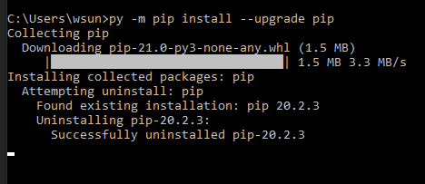
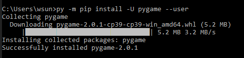
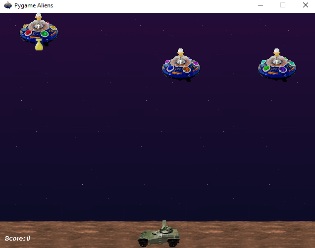
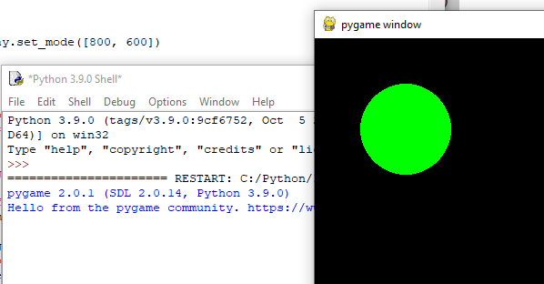

# 2.1 Get Start PyGame

PyGame is a Free and Open Source Python programming library for making multimedia application like games.

PyGame is highly portable and runs on nearly every platform and operating
system. Millions of people have downloaded pygame itself, which is a whole lot of
bits flying across the webs.

<https://www.pygame.org>

## 1 Install PIP and PyGame

### 1.1 update  `PIP`

PIP is a package manager for Python packages, or modules if you like.

[what is pip](https://www.w3schools.com/python/python_pip.asp)

If you have Python version 3.4 or later, PIP is included by default.

- [download python](https://www.python.org/downloads/)
- [How to install python](https://onedrive.live.com/?authkey=%21ABw%2DLzmG9zyRWFA&cid=61E2F373B0D0BEF9&id=61E2F373B0D0BEF9%2150723&parId=61E2F373B0D0BEF9%2150531&o=OneUp)

You may need update your `pip` version,

Run below command in command line:

```shell
python.exe -m pip install --upgrade pip
```

or

```shell
py -m pip install --upgrade pip
```



**Note**
The package is installed to particular version of python you are using.
Make sure you which version of python you are using:
`py -V`

### 1.2 install pyGame

- Use the Command to install PyGame  
`py -m pip install -U pygame --user`


- Test if you pygame is installed
`py -m pygame.examples.aliens`


## 2 Your fist PyGame Code

### 2.1 Drawing a dot on Screen with PyGame

```python
# ShowDot.py
# this script is show how to initial a pygame and draw a circle on tha page
import pygame

# initial the game
pygame.init()
screen = pygame.display.set_mode([800, 600])

# boolean flag to use control game run or quit
keep_going = True

# some data defined for game to use
GREEN = (0, 255, 0)  # RGB color triplet for GREEN
radius = 50

# only when keep_going is true, the game will running
while keep_going:
    # bellow code is for quit the game
    for event in pygame.event.get():
        if event.type == pygame.QUIT:
            keep_going = False
    # below code is for draw a circle in the screen
    pygame.draw.circle(screen, GREEN, (100, 100), radius)

    # refresh the screen displa
    pygame.display.update()

pygame.quit()
```

