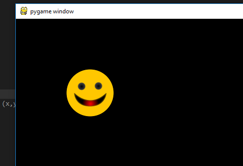
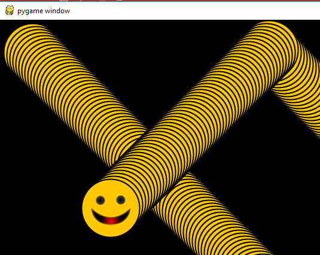

# 2.2 Build Smiley Pong Game

## 1. Load a image on Screen with PyGame

In the folder where you have the python code,
create a `images` folder, Save the image as happyface.png to it.


```python
# ShowPic.py
# this script is demo how to load a image to the pygame screen

import pygame  # Setup

pygame.init()
screen = pygame.display.set_mode([800, 600])
keep_going = True

# define the picture path and name, it in same location of the script
pic = pygame.image.load("images/happyface.png")

while keep_going:  # Game loop
    for event in pygame.event.get():
        if event.type == pygame.QUIT:
            keep_going = False

    # blit() method will load the image from hard disk.  position will be (x,y)
    screen.blit(pic, (100, 100))

    pygame.display.update()

pygame.quit()  # Exit
```



## 2. Make the image bounce onScreen with PyGame!

### 2.1 Diagrame of the logic


### 2.2 Code example

```python
import pygame  

# 1 initial game
pygame.init()
screen = pygame.display.set_mode([800,600])
pygame.display.set_caption("Happy Face")
keep_going = True
pic = pygame.image.load("happyface.png")
color_key = pic.get_at((0,0))  
pic.set_colorkey(color_key) #Set the transparent colorkey
pic_x = 0
pic_y = 0
BLACK = (0,0,0)
WHITE = (255,255,255)
timer = pygame.time.Clock()
speed_x = 5
speed_y = 5

pic_w = pic.get_width()
pic_h = pic.get_height()

points = 0
lives = 5
font = pygame.font.SysFont("Times", 24)


#2 Game loop if keep_going is true
while keep_going:   
    # 3 check event
    for event in pygame.event.get(): 
        if event.type == pygame.QUIT: 
            keep_going = False
        
    #4 update pic position  
    # 4.1 update pic x,y with speed         
    pic_x += speed_x
    pic_y += speed_y
    
    # 4.2 check the bouncing 
    if pic_x <= 0 or (pic_x + pic_w) >= 800:
        speed_x = -speed_x
        print("pic_x+pic_w>800: "+str(pic_x + pic_w))
    if pic_y <= 0 or (pic_y + pic_h) >= 600:
        speed_y = -speed_y
        print("pic_y+pic_h>600: "+str(pic_y + pic_h))
     
    # 4.3 draw the picture on the screen    
    screen.fill(BLACK)    
    screen.blit(pic, (pic_x, pic_y))  
    
    # 5 Update Display   
    pygame.display.update()
    timer.tick(60)  # how many frame every sec, https://www.pygame.org/docs/ref/time.html

# Quite/Exit Game    
pygame.quit()  

```

### 2.3 bounce happy face


<https://github.com/stoneskin/mlcccCoding/blob/master/2018-02-04/python/07-pyGame-1/04.SmileyBounce.py>


- if not refill background



### 2.4 Key points

#### 2.4.1  control the refresh rate with Clock Class

Pygame has a tool that can help us control the speed of our animation: the `Clock` class.

*[what is `Class` in programming](https://www.hackerearth.com/practice/python/object-oriented-programming/classes-and-objects-i/tutorial/)*

Below line will create a variable all timer linked to a Clock object.

```python
#define the time at init section
timer = pygame.time.Clock()
```

Below line will tell tmer to "tick" 60 time per second:

```python
## make the tick to 60 in the game loop
timer.tick(60) 
```

#### 2.4.2 Bounce from the wall

if location x touch the left board "0" or touch the right board location "800", change the speed direction.

``` python
  if x <= 0 or (x + pic_w) >= 800:
        speed_x = -speed_x
```

#### 2.4.3 Change the direction

The direction will changed by move speed of `speed_x` and `speed_y`

try different speed to see how the ball moving.