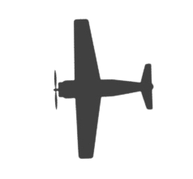

# 3 Build a AirForce Game step by step (Part 2)

## 3.4 Step4: Let air plane fire bullet

- Prepare the bullet
  

    ```python
    #initial bullets
    bullets=[]
    bullet = pygame.image.load("images/bullet.png")
    ```

- Draw the bullet in screen
  
    ```python
    #4 - Draw bullet
        index=0 
        for bulletPos in bullets:

            bulletPos[0]=bulletPos[0]+1
            screen.blit(bullet,bulletPos)

            #remove bullet if out the screen
            if bulletPos[0]<-64 or bulletPos[0]>640 or bulletPos[1]<-64 or bulletPos[1]>480:
                bullets.pop(index)  #remove from list
            index+=1  
    
    ```

- Mouse Click or space key down to fire

    ```python
        # use mouse click or space to fire         
        if event.type==pygame.MOUSEBUTTONDOWN or (event.type==pygame.KEYDOWN and event.key==pygame.K_SPACE):
            bullets.append([player_pos[0],player_pos[1]]) 
    ```


[Source Code of Step4](../python/2_LearnPython/codes/PyGameSteps/step4.py)


## 3.5 Step 5: Add Enemies

- Prepare images for enemies  



- initial the code for Enemies
  
    ```python
    #5 initial enemies
        enemyImg = pygame.image.load("images/enemy2.png")
        enemys=[[640,100]]
        enemySpeed=-0.5
        enemyMaxnumber=5 #how many enemies in the screen same time
    ```

- in the keep_going loop , draw enemies

    ```python  
    #5 Draw enemies random time and only keep 5 enemies in screen
        if(random.randint(1,100)<3 and len(enemys)<enemyMaxnumber): 
            enemys.append([640, random.randint(50,430)]) 

        index=0
        for enemyPos in enemys:               
            enemyPos[0]+=enemySpeed
            if enemyPos[0]<50:
                enemys.pop(index)
            screen.blit(enemyImg, enemyPos)
            index+=1   
    #end step 5
    ```

- Load a different Enemy image

    ```python
        #5 enemy
        enemyImg = pygame.image.load("images/enemy1.png")
        enemyImg=pygame.transform.scale(enemyImg, (75, 75))
        enemys=[[640,100]]
        enemySpeed=-0.3
        enemyMaxnumber=5
    ```

- Add code remove enemies
  
    ```python

    #4 - Draw bullet
        enemy_index=0
        for bulletPos in bullets:    
            bulletPos[0]=bulletPos[0]+2
            screen.blit(bullet,bulletPos)

            #remove bullet if out the screen
            if bulletPos[0]<-64 or bulletPos[0]>640 or bulletPos[1]<-64 or bulletPos[1]>480:
                bullets.pop(enemy_index)  #remove from list
            enemy_index+=1
    ```

- results
  
 

 [Code with step 5](../python/2_LearnPython/codes/PyGameSteps/step5.py)

## 3.6 Step 6: Check the collision

- update code in the loop of enemies

    ```python
        enemy_index=0
        for enemyPos in enemys:               
            enemyPos[0]+=enemySpeed
            if enemyPos[0]<50:
                enemys.pop(enemy_index)
            screen.blit(enemyImg, enemyPos)
            
        # 6 Check for collisions
            enemyRect=pygame.Rect(enemyImg.get_rect())
            enemyRect.left=enemyPos[0]
            enemyRect.top=enemyPos[1]
            bullet_index=0
            for bulletPos in bullets:
                bulletRect=pygame.Rect(bullet.get_rect()) # get rect of bullet image size
                bulletRect.left=bulletPos[0]
                bulletRect.top=bulletPos[1]            
                if bulletRect.colliderect(enemyRect):
                    enemys.pop(enemy_index)
                    bullets.pop(bullet_index)
                bullet_index+=1               
        # end step 6
            enemy_index+=1

    ```

- source code
  
  [Code with step 6](../python/2_LearnPython/codes/PyGameSteps/step6.py)

## 3.7 Step 7: Add explosion animation

- prepare images of explosion
  [download all explosion images](../python/2_LearnPython/codes/PyGameSteps/images/explosions.zip)
  
- initial explosion before `keep_going` loop

    ```python
    #7 initial load explosion animation images
    explosions=[] # store explosion location and img index [(x,y),i,t] 
    explosion_anim=[] #store img for animation
    BLACK = (0, 0, 0)
    explosion_time=60
    for i in range(9):
        filename = 'Explosion0{}.png'.format(i)
        img = pygame.image.load("images/"+ filename).convert()  # convert will create a copy that will draw more quickly on the screen.
        img.set_colorkey(BLACK)
        img= pygame.transform.scale(img, (75, 75))
        explosion_anim.append(img)
        
    ```

- add explosion code before display update
  
    ```python
        #step 7 plan explosion animation    
        for explosion in explosions:
            if(explosion[1]<9):
                screen.blit(explosion_anim[explosion[1]],explosion[0])
                explosion[2]=explosion[2]-1
                if(explosion[2]<0):     
                    explosion[1]=explosion[1]+1
                    explosion[2]=explosion_time
                    
            else:
                explosions.pop(0) # the first one is always first completed 
        #end step7
    ```

- source code
  
  [Code with step 7](../python/2_LearnPython/codes/PyGameSteps/step7.py)


