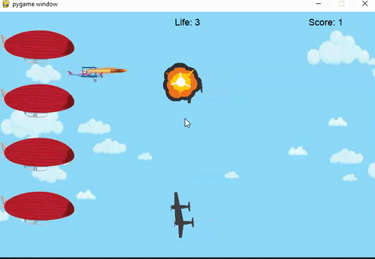

# 3 Build a AirForce Game step by step (Part 3)

## 3.8 Step8: Load sound and play music

- prepare sound and music
  [download sounds](../python/2_LearnPython/codes/PyGameSteps/sounds/sounds.zip)

- initial sound and music
  
  ```python
  #8 initial load sound
    shooting_sound = pygame.mixer.Sound('sounds/pew.wav')
    pygame.mixer.music.load('sounds/BG.ogg')
    pygame.mixer.music.play(-1) ## makes the gameplay sound in an endless loop
  ```

- add the sound in the collision check

```python
            if bulletRect.colliderect(enemyRect):
                enemys.pop(enemy_index)
                bullets.pop(bullet_index)

                # step7 play explosion in the location of enemy
                explosions.append([enemyPos,0,explosion_time])
```

- source code
  [src with step 8](../python/2_LearnPython/codes/PyGameSteps/step8.py)

## 3.9 Step9: Draw text for score, life and game over

- initial the score, life

```python
    #initial for step 9
    score=0
    life=3
    game_over=False
```

- define function for draw text
  
```python
def draw_text(surf, text, size, x, y):
    ## selecting a cross platform font to display the score
    font = pygame.font.Font(pygame.font.match_font('arial'), size)
    text_surface = font.render(text, True, BLACK)       ## True denotes the font to be anti-aliased 
    text_rect = text_surface.get_rect()
    text_rect.midtop = (x, y)
    surf.blit(text_surface, text_rect)
```

- draw life and score after load background

```python
screen.blit(background,(0,0))  

#step 9 draw life and score on 
    game_over=life<1 #step9 make game over if life small then 1

    draw_text(screen, "Score: "+str(score), 18, width -100, 10)
    draw_text(screen, "Life: "+str(life), 18, width/2, 10)
    if(game_over):
        draw_text(screen, "Game Over", 50, width/2, height/2 -40)
```

- add condition on game over

```python
    if(not game_over):
        screen.blit(player, player_pos)
    ...
    ...
```

- source code
  
  [source code with step9](../python/2_LearnPython/codes/PyGameSteps/step9.py)

- final result
  
  