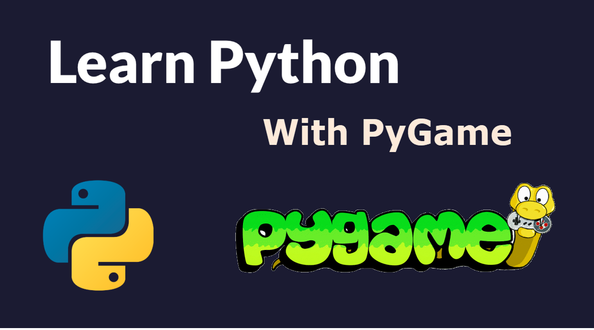
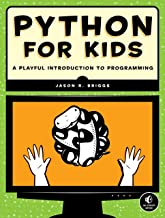
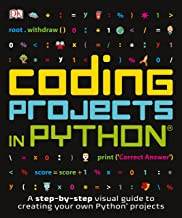
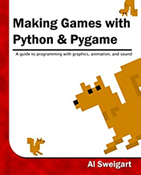

# Grade 6-8 Python and PyGame Programming

## Description

Learn programming while having fun in building your own game!
Students will learn programming by writing Python code with PyGame Library: first learn some basic programming skills and then learn to use Python code to build multiple games in PyGame.
Session1: Python basics with Turtle
Session2: Get started with PyGame
Session3: Use PyGame to build your Own Game

### MLCCC Classroom Zoom Meeting rules

* Change your zoom user name to the real name same as you register the MLCCC classes.
* Keep your mic mute until The teacher or TA asking you to talk.

### Class Requirements

* Students need a computer that can install and run Python
* Students need to have some programming experience and be able to follow the rules in the game and the classroom.

### Recommended books (optional)

* Below books are for you to learn more python programming yourself 
   

## Session 1: Python basics with Turtle

1. [6/25] [Get Start with Python](1.1_GetStart_With_Python.md)

   * What is coding
   * Why Python
   * Install Python
   * Install Python Editor
   * Write your first python code
   * Drawing in Turtle

2. [7/2] [Basic Python -1: Variables and Types](1.2_Python_Variables_Types.md)
   * Number and String
   * Int and float
   * Boolean and Operator

3. [7/9] Basic Python -2: Loop and repeat
    * What is Loop
    * For Loop
    * While Loop
    * Double Loops
    * Nested for loops

### Session 2: Get started with PyGame

1. [7/16] Get Start PyGame
   * Install PIP and PYGame
   * Your first PyGame Code
  
2. [7/23] Build Smiley Pong Game

3. [7/30] Smiley Pong Game continue

### Session 3: Use PyGame to build your Own Game

1. [8/6] Build a AirForce PyGame -1

2. [8/13] Build a AirForce PyGame -2

3. [8/20] Demo your Project
