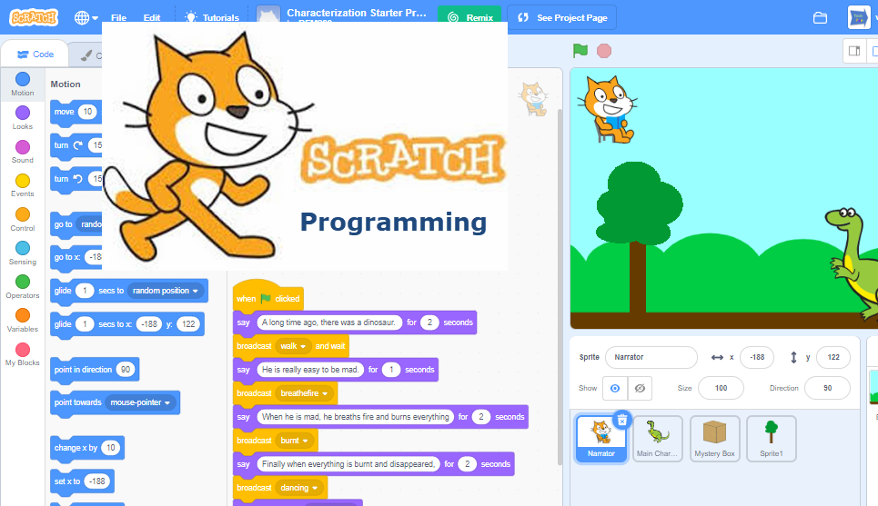

For [MLCCC online Summer Camp 2020](http://www.mlccc.org/MlcccV2/Forms/V2/Programs/Camp/SummerCamp.aspx)

# Grade 3-5 Scratch Animation and Game Programming

## Description

Students will use Scratch to learn programming conceptes by createing animation and game

### Session 1

1. [6/19] Get Start with Scratch
   - intruduce scratch and mclccc studio
   - A walking through scratch
   - Tutorials:[Step by Step](1.stepbystep.pdf)
   - Activities: [10 blocks](./2.10blocks.pdf)
  
2. [6/20] Animation and Drawing on Scratch
   - Animation Your Name
   - Character Animation
   - Drawing Animation
   - project : About Me

### Session 2

1. [7/10] Animation with music
   - Play sound, make rhythem
   - Animatie the instrument
   - make a melody, play a chord
   - Beatbox sound, record sound
   - Project: build a Band
2. [7/17] Music video and dance
   - play song and loop
   - Cance move
   - Shadow effect and interactive Dance
   - Project: Music Video

### Session 3

1. [7/24] Story Animation
   - start a story annd conversation
   - Backdrop and Character
   - Add your voice, text to voice
   - Animation
   - interactive
2. [7/31] Make a Pet with Scratch
   - choose a pet and animate it
   - Feed you ped
   - Let your pet say something
   - Play a toy
   - Your pet is hungry

### Session 4

1. [8/7] Chase Game and Pong Game
   - move and chase
   - play sound
   - score and level
   - you win or game over
2. [8/14] Jump Game and Catch Game
   - jump
   - moving obstace
   - score
   - fall down and catch it
   - bonus point
