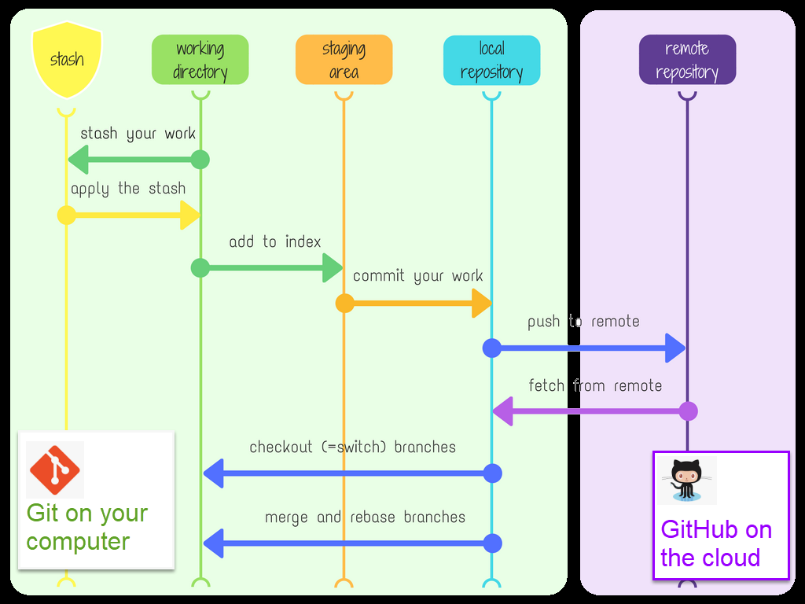
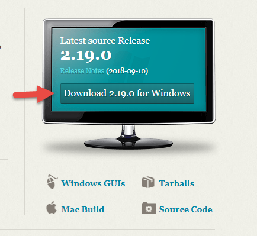

# 01 Learn to use Git for version Control (basic)

## 1.1 What is Version Control

- Version control system are software tools that help you manage changes of source code over time.
  

## 1.2. Why I need the Version Control System

- I want to keep entire code and change history. Just like save my game progress in each checkpoint.
- I want to view my code change history, and want to start from a previous check point.
- I want to get my code and continue working on it from another computer.
- I want my teammate can access the code and contribute from their computers too.
- I want my friends join my team and with together, but I don't want they overwrite my saved progress.

## 1.3 What are Git and GitHub

- Git is a VCS(Version Control System) help you have version control for your code
- Git is the most popular VCS in the world.
- Git is powerful and easy to use.
- GitHub is a website and service the keep your source code , so you can access from any computer and share with your team.

## 1.4 How Git and GitHub works

- You can create a local repository for your project by Git
- You can staging your code change before commit to local repository
- You can push to or fetch from the remote repository

## 1.5 Download and install git to your computer

- Download git from <https://git-scm.com/>
  
- Client to install,  Click next and all use default settings
  
## 1.6 Create a github acct

- Go to  <https://github.com/> and create a account.
  

## 1.7 Download and install a git GUI

- You can chose any client from <https://git-scm.com/downloads/guis/>
- you could try smartGit <https://www.syntevo.com/smartgit/>
- Or tyr to use VS Code with git extension

## 1.8 Git command line

Use GUI client will save you time to remember those command line, but below is some git command line you can use when gui not available:

- <https://dzone.com/articles/top-20-git-commands-with-examples>
- <https://education.github.com/git-cheat-sheet-education.pdf>
- Examples
  - Show you current user name
   `Git config user.name`  
  - Change you current user name
    `git config user.name "myname"`