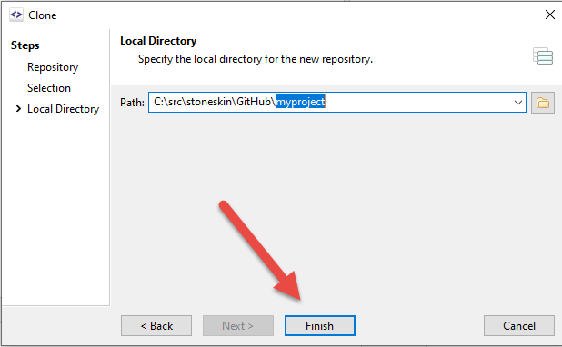

# Git.02 Use SmartGit as git client

## 1. Install SmartGit

- download SmartGit from <https://www.syntevo.com/smartgit/>, chose the version match your operating system

- for windows, it will download a zip file, please open it and run the setup.exe file with Extract All.

- Chose `No-commercial license` during you install the SmartGit
    - Install SmartGit [step by step](installSmartGit/installSmargGit.md) 

## 2. Create a repository in your github account

- In your github home page, click the  create new icon or click Start a project button
      

- Input your name of project, and create your first repository
  

- go to you repository page, ex https://github.com/{youracctname}/myproject, get the Clone url

## 3. SmartGit Clone your new project repository

- In SmartGit, Repository -> Clone
  

- If you copy the url, the url will auto loaded to the Remote repository
  

- click next
  

- chose your project position 
  

## 4. Add your code to the Working folder

- Add some code to your working folder, it will show on the `working Tree`

- You could select the file you want to stage, and click stage button

- You also could skip the Stage step, can commit what you selected for commint

- After commit, the committed files change will not on the Working Tree

## 5. Push you change to the remote

- There are Pull, Sync, Push button on the top of the manual bar

  - Pull is get change from remote to local
  - Sync is to make local and remote same, both have latest change
  - Push is just send you local change to remote server

- First time you push the code to remote github, you will be asking username and password
  
  

- If you need change username password, got to menu ->Edit ->Preference

  

- After click Sync or Push, your local committed code will show on the github
  