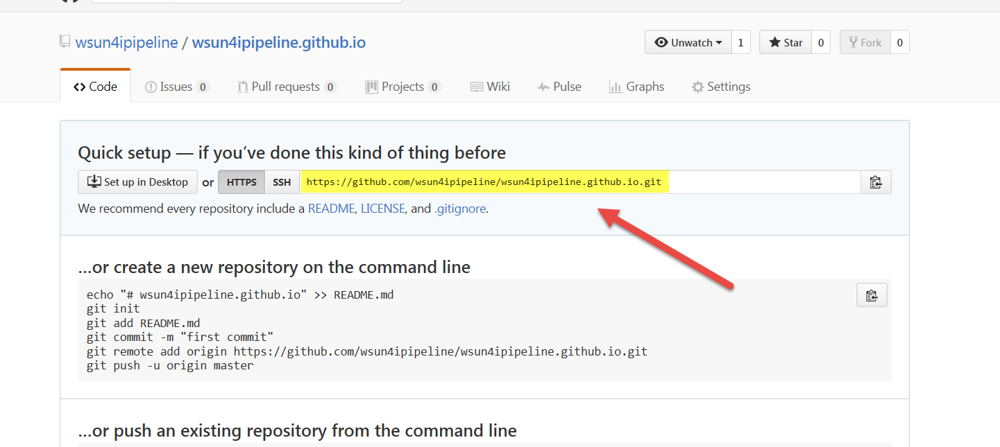
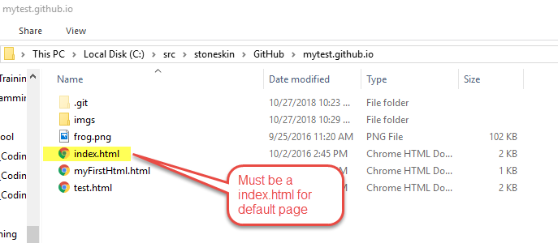
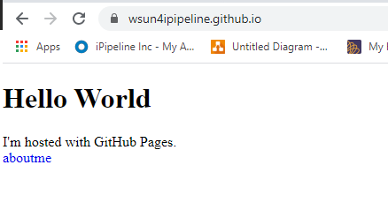

# Git.03 Use GitHub Sites to host your web project

## 1. Create repository for your website

Once you've signed in, wil will able to create a new repository.

Please create a new repository make sure the name start with your User Name and after with ".github.io", make sure your username here is case sensitive.
ex: "`{yourUserName}.github.io`"


Note: you could check the Initialize the repository with a README, so the default readme.md file will be your default page

## 2. Clone your new repository

Follow the [previous class step](https://stoneskin.github.io/Tools/Git.02-UserSmartGitAsGitClient.html) to clone your web project repository



## 3. Update the Readme.md and check in to master/main branch

The Readme.md are using markdown format, github will auto generate html for you.

to learn markdown please check below

- <https://guides.github.com/features/mastering-markdown/>
- <https://www.markdownguide.org/cheat-sheet/>

## 4. Add your first web page

Markdown could let you write your page quickly, but it have many limitation. if you want get a real HTML page, you could add your own `HTML` files.

if you put your `index.html`,  it will replace the readme.md as your default page.

### 4.1 Create a index.html

- Create index.html file like below:

```html
<!DOCTYPE html>
<html>
<body>
<h1>Hello World</h1>
<p>I'm hosted with GitHub Pages.</p>
<div>

    <a href="https://github.com/{yourUserName}">My gitHub</a>

</div>
</body>
</html>
```

- Commit to your repository

### 4.2 Push to the github and check your site

- Push to your remote github acct,
- Visit the `https://{yourUserName}.github.io/`, you will see your page be updated like below



## 5. visit your first GitHub Page



## 6. Ref

- <https://guides.github.com/features/pages/>
- <https://guides.github.com/features/mastering-markdown/>