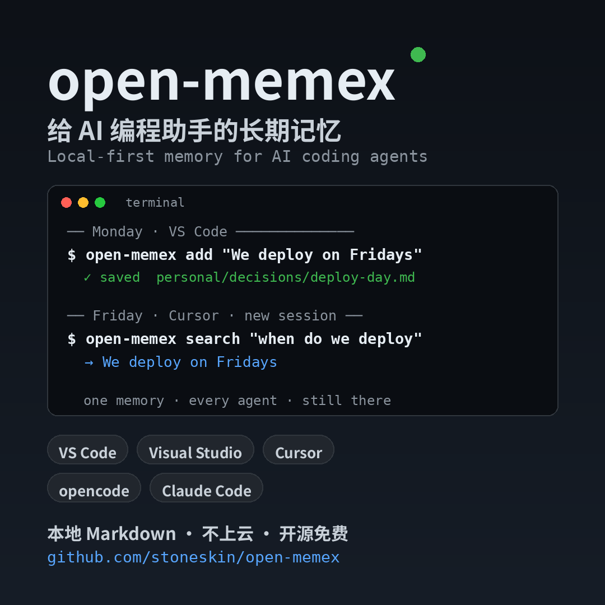

# open-memex

**Persistent memory for AI coding agents — on your machine, in plain Markdown, shared by every tool you code with.**

[GitHub repository](https://github.com/stoneskin/open-memex){:target="_blank"} · [npm package](https://www.npmjs.com/package/open-memex){:target="_blank"} · [Documentation](https://github.com/stoneskin/open-memex#readme){:target="_blank"} · [Releases](https://github.com/stoneskin/open-memex/releases){:target="_blank"}




Every AI coding session starts from zero: you re-explain the project, the agent rediscovers the same gotchas, and yesterday's decisions vanish when the chat ends. open-memex gives your agents a memory that survives the session.

Say "remember: we deploy on Fridays" once. Next week, Copilot, Cursor, opencode, or Claude Code already knows — because they read and write the same local memory on your machine.

## Get started in about a minute

Requirements: Node.js **22.14 or newer**.

```sh
npm install -g open-memex
open-memex init
open-memex add "We deploy only before noon on Fridays" --type decision
```

Then ask your agent what it remembers. `open-memex init` auto-detects supported editors and wires up the integration for you.

## Why open-memex?

- **One memory, every agent.** Developers rarely use only one AI tool. open-memex avoids separate memory silos by giving the tools on one machine a shared local store.
- **Your files, your rules.** Memories are plain Markdown files you can read, edit, search with normal tools, back up, or delete. A rebuildable SQLite FTS5 index makes them fast to retrieve.
- **Local-first by design.** No account, no cloud service, no telemetry. Personal memories never leave the machine unless you explicitly export or share something.
- **Human review stays in the loop.** Capture can be automatic or agent-assisted, but memory remains inspectable and correctable — hide it, supersede it, forget it, or review it before it is shared.
- **Teams share through Git.** Project knowledge can move from a personal draft to a reviewed project memory through the normal branch / pull-request workflow instead of a separate sync service.

## How it works


1. **Capture** — Save a decision, constraint, preference, lesson, or project fact through your agent, the CLI, or supported keyword triggers.
2. **Store** — open-memex writes a structured Markdown memory and updates its local SQLite keyword index.
3. **Recall** — In a later session, the agent can search the memory or receive relevant context automatically where the host supports first-turn injection.
4. **Review and share** — Personal memories stay local. Project memories can be proposed, reviewed, approved, and published through Git.

## Works with the tools you already use

open-memex provides a native opencode plugin and a standard MCP server used by tools including:

- VS Code Copilot
- Cursor
- Claude Code
- Visual Studio
- opencode

The same memory layer is underneath each integration, so a constraint captured in one editor can be respected in another.

## Built for knowledge that should outlive a chat

Use open-memex for the long tail of engineering knowledge that rarely belongs in a formal design document:

- deployment rules and environment quirks
- API limits and integration constraints
- architecture decisions and the reasons behind them
- recurring failure modes and their fixes
- team conventions and review expectations
- your own working preferences

## Privacy and safety

- Memories live locally; there is no open-memex cloud.
- Common API keys and tokens are masked before a memory is saved.
- Text wrapped in `<private>…</private>` is stripped before saving.
- `personal` scope never syncs. Project sharing is explicit.
- Run `open-memex doctor` to check the installation, scope resolution, storage, editor wiring, and SQLite driver.

## Project status

open-memex is open source under the Apache-2.0 license. The current stable release is **0.7.1**. Start with the [GitHub README](https://github.com/stoneskin/open-memex#readme){:target="_blank"} for the full guide, or open a question in [GitHub Discussions](https://github.com/stoneskin/open-memex/discussions){:target="_blank"}.

Created by [Mr Sun](https://stoneskin.github.io/).
