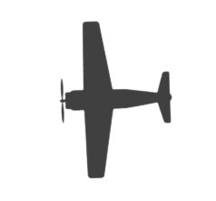
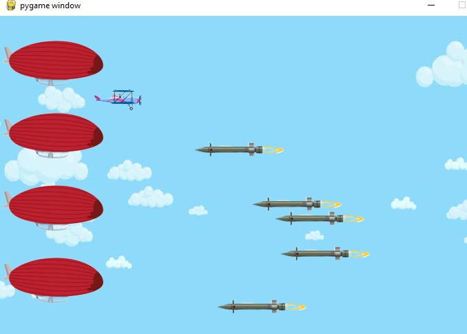

# 10.4 Build a AirForce Game step by step (Part 2)

## 10.4.1 Step 5: Add Enemies

- Prepare images for enemies  



- initial the code for Enemies
  
```python
#5 initial enemies
    enemyImg = pygame.image.load("images/enemy2.png")
    enemys=[[640,100]]
    enemySpeed=-0.5
    enemyMaxnumber=5 #how many enemies in the screen same time
```

- in the keep_going loop , draw enemies

```python  
 #5 Draw enemies random time and only keep 5 enemies in screen
    if(random.randint(1,100)<3 and len(enemys)<enemyMaxnumber): 
        enemys.append([640, random.randint(50,430)]) 

    index=0
    for enemyPos in enemys:               
        enemyPos[0]+=enemySpeed
        if enemyPos[0]<50:
            enemys.pop(index)
        screen.blit(enemyImg, enemyPos)
        index+=1   
#end step 5
```

- results
  
 

 [Code with step 5](2_LearnPython/codes/PyGameSteps/step5.py)

## 10.4.2 Step 6: Check the collision

- update code in the loop of enemies

```python
    enemy_index=0
    for enemyPos in enemys:               
        enemyPos[0]+=enemySpeed
        if enemyPos[0]<50:
            enemys.pop(enemy_index)
        screen.blit(enemyImg, enemyPos)
        
    # 6 Check for collisions
        enemyRect=pygame.Rect(enemyImg.get_rect())
        enemyRect.left=enemyPos[0]
        enemyRect.top=enemyPos[1]
        bullet_index=0
        for bulletPos in bullets:
            bulletRect=pygame.Rect(bullet.get_rect()) # get rect of bullet image size
            bulletRect.left=bulletPos[0]
            bulletRect.top=bulletPos[1]            
            if bulletRect.colliderect(enemyRect):
                enemys.pop(enemy_index)
                bullets.pop(bullet_index)
            bullet_index+=1               
    # end step 6
        enemy_index+=1

```

- source code
  
  [Code with step 6](2_LearnPython/codes/PyGameSteps/step6.py)

## 10.4.3 Step 7: Add explosion animation

- prepare images of explosion
  [explosion images](2_LearnPython/codes/PyGameSteps/images/explosions.zip)
- initial explosion before `keep_going` loop

```python
#7 initial load explosion animation images
explosions=[] # store explosion location and img index [(x,y),i,t] 
explosion_anim=[] #store img for animation
BLACK = (0, 0, 0)
explosion_time=60
for i in range(9):
    filename = 'Explosion0{}.png'.format(i)
    img = pygame.image.load("images/"+ filename).convert()  # convert will create a copy that will draw more quickly on the screen.
    img.set_colorkey(BLACK)
    img= pygame.transform.scale(img, (75, 75))
    explosion_anim.append(img)
    
```

- add explosion code before display update
  
```python
    #step 7 plan explosion animation    
    for explosion in explosions:
        if(explosion[1]<9):
            screen.blit(explosion_anim[explosion[1]],explosion[0])
            explosion[2]=explosion[2]-1
            if(explosion[2]<0):     
                explosion[1]=explosion[1]+1
                explosion[2]=explosion_time
                
        else:
            explosions.pop(0) # the first one is always first completed 
    #end step7
```

- source code
  
  [Code with step 7](2_LearnPython/codes/PyGameSteps/step7.py)

## 10.4.4 Step8: Load sound and play music

- prepare sound and music
  [download sounds](2_LearnPython/codes/PyGameSteps/sounds/sounds.zip)

- initial sound and music
  
  ```python
  #8 initial load sound
    shooting_sound = pygame.mixer.Sound('sounds/pew.wav')
    pygame.mixer.music.load('sounds/BG.ogg')
    pygame.mixer.music.play(-1) ## makes the gameplay sound in an endless loop
  ```

- add the sound in the collision check

```python
            if bulletRect.colliderect(enemyRect):
                enemys.pop(enemy_index)
                bullets.pop(bullet_index)

                # step7 play explosion in the location of enemy
                explosions.append([enemyPos,0,explosion_time])
```

- source code
  [src with step 8](2_LearnPython/codes/PyGameSteps/step8.py)

## 10.4.5 Step9: Draw text for score, life and game over

- initial the score, life

```python
    #initial for step 9
    score=0
    life=3
    game_over=False
```

- define function for draw text
  
```python
def draw_text(surf, text, size, x, y):
    ## selecting a cross platform font to display the score
    font = pygame.font.Font(pygame.font.match_font('arial'), size)
    text_surface = font.render(text, True, BLACK)       ## True denotes the font to be anti-aliased 
    text_rect = text_surface.get_rect()
    text_rect.midtop = (x, y)
    surf.blit(text_surface, text_rect)
```

- draw life and score after load background

```python
screen.blit(background,(0,0))  

#step 9 draw life and score on 
    game_over=life<1 #step9 make game over if life small then 1

    draw_text(screen, "Score: "+str(score), 18, width -100, 10)
    draw_text(screen, "Life: "+str(life), 18, width/2, 10)
    if(game_over):
        draw_text(screen, "Game Over", 50, width/2, height/2 -40)
```

- add condition on game over

```python
    if(not game_over):
        screen.blit(player, player_pos)
    ...
    ...
```

- source code
  
  [source code with step9](2_LearnPython/codes/PyGameSteps/step9.py)